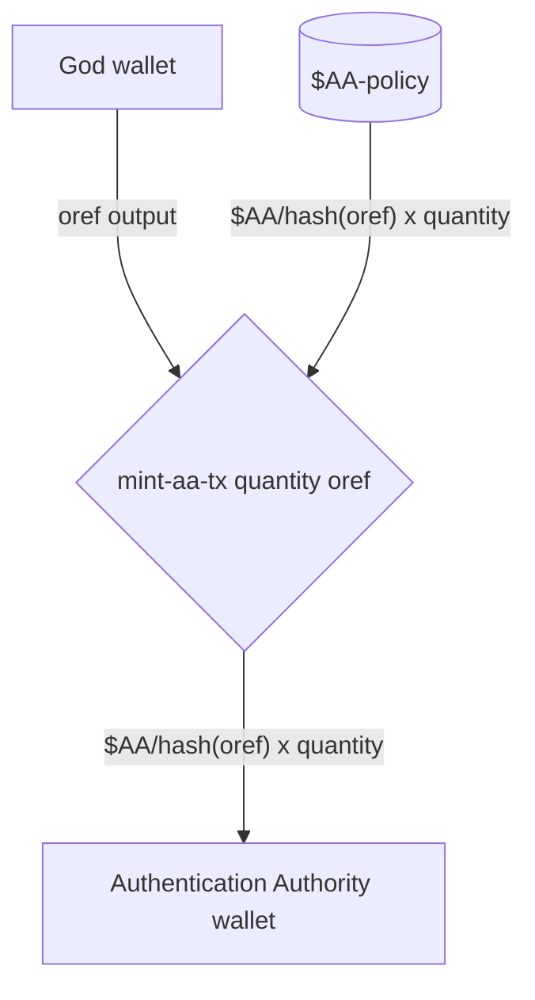
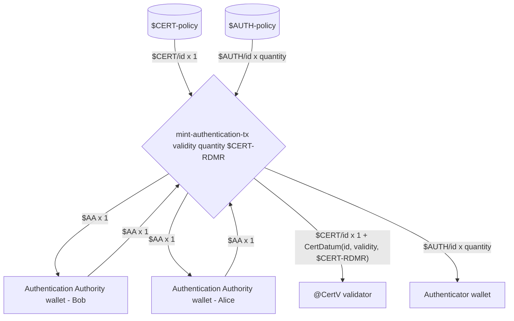
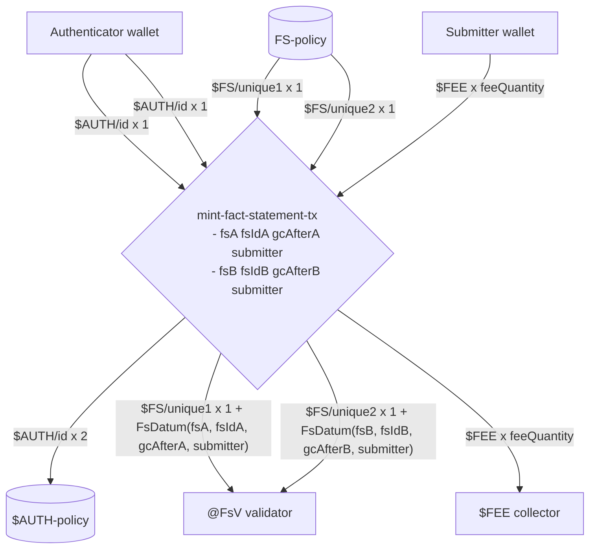
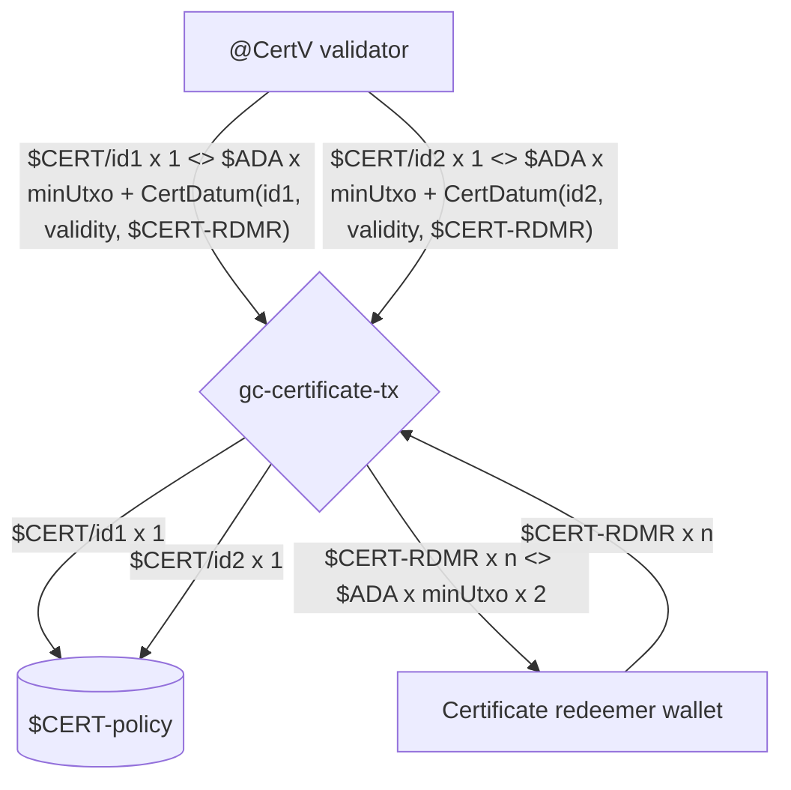

# COOP Plutus protocol

## Protocol parameters

Parameters used at Protocol Genesis.

### <a name="total-aa-tokens">Total Authorization Authority tokens</a>

Total quantity of `$AA` tokens to mint.
These tokens can be distributed to any number of `Authorization Authority` wallets to provide:

1. Backup and redundancy in case of loss,
2. Multi-signature scheme for [minting authentication tokens](#mint-authentication-tx).

### Required Authorization Authority tokens {#required-aa-tokens}

Required quantity of `$AA` tokens that must be consumed when [minting authentication tokens](#mint-authentication-tx).
These tokens can be in one or many inputs, enabling multi-signature scheme to be adopted.

## Transactions

### Transaction diagram notation {#transaction-diagram-notation}

Transaction diagrams are specified using the [Mermaid Sequence Diagrams](https://mermaid-js.github.io/mermaid/#/sequenceDiagram).

Sequence diagram element description:

- Rectangle - Something with an Address (Validator or Wallet),
- Pool - A minting policy,
- Diamond - Transaction (sometimes with parameters),
- Line
  - Consumes TxOut if going from an Address (Rectangle),
  - Mints a value if going from a Minting Policy (Pool),
  - Burns a value if going to a Minting Policy (Pool),
  - Provides a signature if going from a Wallet
- Dotted - references TxOut

#### Textual notation used

##### Values

A `Token` is a tuple of `CurrencySymbol` and `TokenName` (also knows as `AssetClass`).

```bnf
Value --> Token x Quantity [<> Token x Quantity]
Token --> $CurrencySymbol/TokenName | $CurrencySymbol
CurrencySymbol --> <all caps with dashes>
TokenName --> <any>
```

For brevity the `TokenName` can be ommitted when appropriate.

Examples:

- `$ADA x 1`
- `$ADA x q`
- `$FOO x 1`
- `$FOO/bar x q <> $ADA x minUtxoAda`

##### Inputs and outputs

```bnf
IO --> Value + Datum
Datum --> <some record/product notation>
```

Examples:

- `$FOO/bar x q <> $ADA x minUtxoAda + MyDatum(foo=1, bar=2)`

##### Transaction

```bnf
Transaction --> TransactionName [Parameters]
Parameters --> Parameter [Parameters]
TransactionName --> <lowercase with dashes>
Parameter --> <camelCase>
```

Examples:

- `mint-sometokens-tx quantity tokenName`
- `always-validates-tx`

### Mint $AA 'One Shot' tokens - mint-aa-tx {#mint-aa-tx}

**Scripts invoked:**

- [$AA-policy](#aa-policy) - `$AA` minting policy script

**Signatories:**

- [God](#god-wallet)

**Scenario:**

`God` mints `$AA` tokens and sends them to a single `Authentication Authority`.



The `TokenName` of the `$AA` token is set to a hash of the input pointed to by `oref` (See [Hashing inputs for uniqueness](#hashing-for-uniqueness)).

### Mint authentication tokens - mint-authentication-tx {#mint-authentication-tx}

**Scripts invoked:**

- `$AUTH-policy` - `$AUTH` minting policy script
- `$CERT-policy` - `$CERT` minting policy script

**Signatories:**

- Bob `Authentication Authority`
- Alice `Authentication Authority`

**Scenario:**

`Authentication Authority` mints authentication by minting a `$CERT` token and paying it to `@CertV` validator, and minting `$AUTH x quantity` tokens and paying them to a single `Authenticator`.



`id` is computed by hashing `$AA` inputs (TODO: See 'Hashing outputs for uniqueness').
The quantity of `$AA` tokens required are determined by the `$AA required token quantity` protocol parameter (TODO: Add 'See Protocol parameters - $AA token quantity')

### Mint Fact Statement - mint-fact-statement-tx

**Scripts invoked:**

- `$FS-policy` - `$FS` minting policy script
- `$AUTH-policy` - `$AUTH` minting policy script

**Signatories:**

- `Authenticator` wallets
- `Submitter` wallet

**Scenario:**

`Submitter` publishes 2 `Fact Statements` within a single transaction. `Authenticator` provides `$AUTH` tokens for each of the published `Fact Statement` and adds a `$FEE` that will be paid by the `Submitter` to the `Fee Collector`. The `Fact Statements` are made available at the `@FsV` validator for future referencing.



`uniqueId1` and `uniqueId2` are computed by hashing corresponding `$AUTH` inputs used to authenticate each produced `Fact Statement` (TODO: See 'Hashing outputs for uniqueness').

### Garbage collect obsolete certificates - gc-certificate-tx {#gc-certificate-tx}

**Scripts invoked:**

- `$CERT-policy` - `$CERT` minting policy script

**Signatories:**

- `Certificate redeemers`

**Scenario:**

`Certificate redeemer` garbage collects obsolete certificates from `@CertV` validator and reclaims the `Min UTxO Ada` held within.
`CertDatum` indicates which `$CERT-RDMR` token must be spend in order to garbage collect an obsolete certificate.



`$CERT-RDMR` tokens are sent back to the `Certificate redeemer` and all obsolete `$CERT` tokens are burned.

## Tokens

### Authentication Authority token - $AA

- Policy - `$AA-policy` (TODO: Add link)
- Token Name - is set to a `UTxO hash` of the output denoted by `oref`,
- Quantity - the `Authentication Authority` can decide how many `$AA` tokens to mint at protocol genesis,
- Provenance - the `$AA` tokens must be held by `Authentication Authority` wallets and kept safe in an isolated environment
  - Minted with [mint-aa-tx](#mint-aa-tx) transaction,
  - Burned never,
  - Used in [mint-authentication-tx](#mint-authentication-tx) transactions

### Certificate token - $CERT

- Policy - `$CERT-policy` (TODO: Add link)
- Token Name - is set to a unique bytestring computed by hashing `$AA` inputs (TODO: See 'Hashing outputs for uniqueness'),
- Quantity - Each `$CERT` token is unique and only 1 such token exists at any point in time. However, collectively there can be zero or more `$CERT` tokens in the protocol at any time,
- Provenance - the `$CERT` tokens is held at `@CertV` validator
  - Minted with `mint-authentication-tx` transaction,
  - Burned with `burn-certificate-tx` transaction.

### Certificate redeemer token - $CERT-RDMR

> INFO[Andrea]: instead of a $CERT-RDMR token you could just have a
> PKH in the @CertV datum, and check the burn $CERT transaction is
> signed by that, like you do for burning $FS tokens and submitters.
> This would only grant the PKH access to a small amount of Ada, so it
> does not seem like the extra token indirection is warranted.

### Authentication token - $AUTH

- Policy - `AUTH-policy` (TODO: Add link)
- Token Name - is set to a unique bytestring computed by hashing `$AA` inputs (TODO: See 'Hashing outputs for uniqueness'),
- Quantity - Each `$CERT` token is unique and only 1 such token exists at any point in time. However, collectively there can be zero or more `$CERT` tokens in the protocol at any time,
- Provenance - the `$AUTH` tokens is held at `Authentication` wallet
  - Minted with `mint-authentication-tx` transaction,
  - Burned with `mint-fact-statement-tx` transaction.

### Fact statement token - $FS

## Scripts

### $AA-policy

`$AA` minting policy script that validates minting of 'One Shot' `Authentication Authority` (ie. `$AA`) tokens in [minting authentication authority tokens](#mint-aa-tx) transaction.

Policy is implemented as `Coop.Plutus.Aux.mkOneShotMp quantity tokenName oref` such that

- `quantity` denotes the [total amount of `$AA` tokens to mint](#total-aa-tokens),
- `tokenName` is set to a [hash of the of the 'oref' output](#hashing-for-uniqueness),
- `oref` the output owned by the `Authentication Authority` wallet that must be consumed in order to validate minting.

Validation rules:

- check that a specified `TxOutRef` is consumed,
- check that a specified quantity of tokens with a specified token name are minted,
- no paying requirements are enforced.

### $CERT-policy

`$CERT` minting policy script that validates minting of `$CERT` tokens in [minting authentication](#mint-authentication-tx) transactions.

Policy is defined in `Coop.Plutus.mkCertMp` and is instantiated with the `CertMpParams` parameter:

```haskell
-- | CertMp initial parameters
data CertMpParams = CertMpParams
  { cmp'authAuthorityAc :: AssetClass
  -- ^ $AA (Authentication authority) tokens required to authorize $CERT minting
  , cmp'requiredAtLeastAaQ :: Integer
  -- ^ $AA token quantity required to authorize $CERT minting
  , cmp'certVAddress :: Address
  -- ^ Certificate validator @CertV address to pay the $CERT tokens to
  }
```

Policy support two redeemers:

```haskell
-- | CertMp redeemer denoting $CERT mint or burning actions
data CertMpRedeemer = CertMpBurn | CertMpMint
```

Policy works with `CertDatum` datum:

```haskell
-- | Datum locked at @CertV containing information about $AUTH tokens used in authorizing $FS minting
data CertDatum = CertDatum
  { cert'id :: LedgerBytes
  -- ^ Certificate unique identifier (matches $CERT and $AUTH token names)
  , cert'validity :: POSIXTimeRange
  -- ^ Certificate validity interval after which associated $AUTH tokens can't be used to authorize $FS minting
  , cert'redeemerAc :: AssetClass
  -- ^ $CERT-RMDR asset class that must be spent to 'garbage collect' the @CertV UTxO after the certificate had expired
  }
```

Validation rules for minting `$CERT` tokens:

- `CertMpMint` redeemer is used,
- check that the `CertMpParams.cmp'requiredAtLeastAaQ` quantity of `CertMpParams.cmp'authAuthorityAc` are spent (See [Required Authorization Authority tokens](#required-aa-tokens)),
- accumulate and hash `$AA` inputs consumed into a [unique token name](#hashing-for-uniqueness) to use for the `$CERT` token minted,
- check that `$CERT x 1` is paid to `@CertV` validator as indicated in `CertMpParams.cmp'certVAddress`,
- check that `$CERT` output at `@CertV` contains a `CertDatum` such that `CertDatum.cert'id` matches the previously constructed unique token name.

Validation rules for burning `$CERT` tokens:

- `CertMpBurn` redeemer is used,
- for `n` consumed input containing the `$CERT` token,
  - check the transaction validates after the certificate validity period as indicated in the `CertDatum.cert'validity` field of the consumed datum,
  - check that `$CERT-RDMR x 1` value as specified in the `CertDatum.cert'redeemerAc` is spent,
  - accumulate the spent `$CERT x 1` value to burn,
- check that all the spent `$CERT x n` are also burned
- no paying requirements are enforced for `$CERT-RDMR` tokens.

### @CertV

### $AUTH-policy

### $FS-policy

### @FsV

## Wallets

### God

A wallet used to initialize the protocol (ie. Protocol Genesis). Can be discarded after use.

### Authentication Authority {#authentication-authority}

`Authentication Authority` wallets holding `$AA` tokens used to authenticate [minting ephemeral authentication tokens](#mint-authentication-tx).
Note that there can be any number of such wallets and it's left to the `Protocol Operator` to manage their distribution.

> Must be held in a safe environment as compromising $AA wallets can undermine the entire protocol.

### Authenticator {#authenticator}

`Authenticator` wallets hold the `$AUTH` ephemeral tokens that are attached to each [Fact Statement minting](#mint-fact-statement-tx)
transaction to denote 'authentication' by the `Publisher`.

`Authenticators` are used extensively by the Fact Statement publishing backend and as such should be kept safe. However, unlike the [Authentication Authority](#authentication-authority) wallets, if compromised these wallets only impact the integrity of the Protocol for the duration of `$AUTH` tokens held within. After that point compromised wallets can be discarded and replaced with fresh ones, which would then receive new `$AUTH` tokens.

> Protocol Operators manage how many `$AUTH` tokens are minted, how long they are valid and which Authenticator wallets will receive them.

### Submitter {#submitter}

`Submitter` is a wallet used by the user that submits the [Fact Statement minting transactions](#mint-fact-statement-tx) transaction obtained in the `Fact Statement Publishing` protocol.

The wallet needs to provide enough `$FEE` tokens as indicated in the `Fact Statement Publishing` protocol.

### Certificate redeemer {#certificate-redeemer}

`Certificate redeemer` wallets hold the `$CERT-RDMR` tokens and are managed by the `Protocol Operator` similar to how [Authenticator](#authenticator) wallets are managed.
In fact, both wallets can be consolidated in a single wallet for convenience.

Certificate redeemer wallets are in charge of [garbage collecting obsolete certificates](#gc-certificates-tx) by providing the corresponding `$CERT-RDMR` tokens as indicated in the `CertDatum`.

### Fee collector {#fee-collector}

`Fee collector` is any wallet or validator the `Protocol Operator` decides to use to collect `$FEE` tokens in [Fact Statement minting transactions](#mint-fact-statement-tx).

## References

- [Eternal keys considered harmful #34](https://github.com/mlabs-haskell/cardano-open-oracle-protocol/issues/34)
