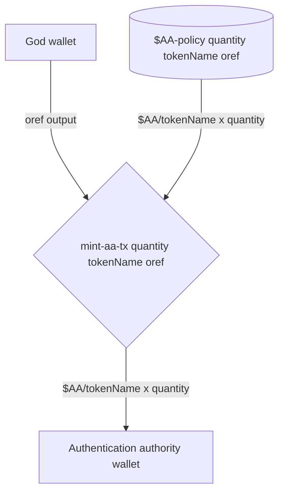
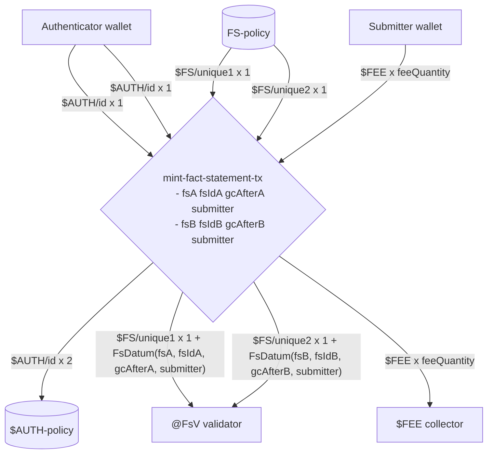
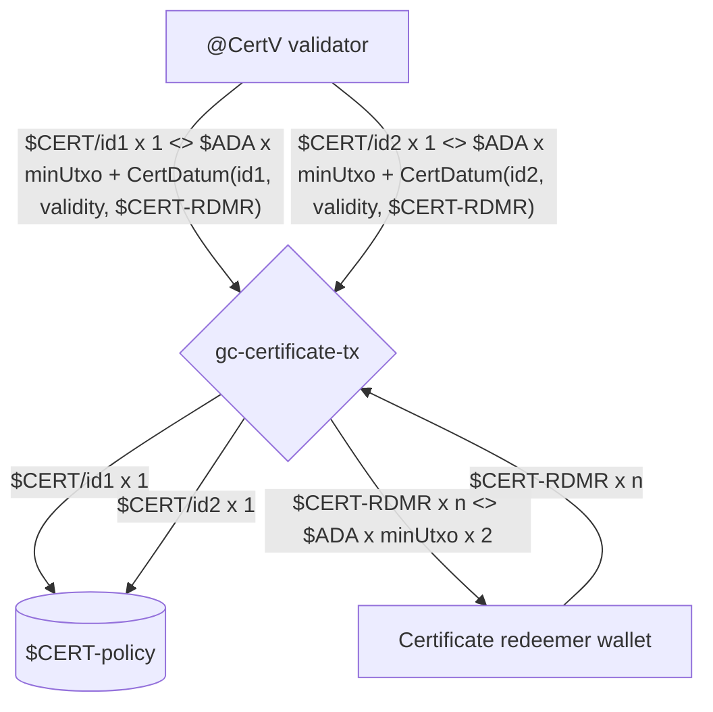

# COOP Plutus protocol

## Transactions

Legend:

- Rectangle - Something with an Address (Validator or Wallet),
- Pool - A minting policy,
- Diamond - Transaction (sometimes with parameters),
- Line
  - Consumes TxOut if going from an Address (Rectangle),
  - Mints a value if going from a Minting Policy (Pool),
  - Provides a signature if going from a Wallet
- Dotted - references TxOut
- $CurrencySymbol/TokenName x Quantity + Datum

### Mint $AA 'One Shot' tokens - mint-aa-tx

**Scripts invoked:**

- `$AA-policy` - `$AA` minting policy script

**Signatories:**

- `God` wallet

**Scenario:**

`God` mints `$AA` tokens and sends them to a single `Authentication authority`.

### Mint authentication tokens `$AUTH` and `$CERT` - mint-authentication-tx

**Scripts invoked:**

- `$AUTH-policy` - `$AUTH` minting policy script
- `$CERT-policy` - `$CERT` minting policy script

**Signatories:**

- Bob's `Authentication Authority` wallet
- Alice's `Authentication Authority` wallet

**Scenario:**

`Authentication authority` mints authentication by minting a single `$CERT` token and paying it to `@CertV` validator, and minting `$AUTH x quantity` tokens and paying them to a single `Authenticator`.

`id` is computed by hashing `$AA` inputs (TODO: See 'Hashing outputs for uniqueness').
The quantity of `$AA` tokens required are determined by the `$AA required token quantity` protocol parameter (TODO: Add 'See Protocol parameters - $AA token quantity')

### Mint Fact Statement - mint-fact-statement-tx

**Scripts invoked:**

- `$FS-policy` - `$FS` minting policy script
- `$AUTH-policy` - `$AUTH` minting policy script

**Signatories:**

- `Authenticator` wallets
- `Submitter` wallet

**Scenario:**

`Submitter` publishes 2 `Fact Statements` within a single transaction. `Authenticator` provides `$AUTH` tokens for each of the published `Fact Statement` and adds a `$FEE` that will be paid by the `Submitter` to the `Fee Collector`. The `Fact Statements` are made available at the `@FsV` validator for future referencing.

`uniqueId1` and `uniqueId2` are computed by hashing corresponding `$AUTH` inputs used to authenticate each produced `Fact Statement` (TODO: See 'Hashing outputs for uniqueness').

### Garbage collect certificates - gc-certificate-tx

**Scripts invoked:**

- `$CERT-policy` - `$CERT` minting policy script

**Signatories:**

- `Certificate redeemer` wallets

**Scenario:**

`Certificate redeemer` garbage collects obsolete certificates from `@CertV` validator and reclaims the `Min UTxO Ada` held within.
`CertDatum` indicates which `$CERT-RDMR` token must be spend in order to garbage collect an obsolete certificate.

`$CERT-RDMR` tokens are sent back to the `Certificate redeemer` and all obsolete `$CERT` tokens are burned.

## Tokens

### Authentication authority token - $AA

- Policy - `$AA-policy` (TODO: Add link)
- Token Name - is set to a `UTxO hash` of the output denoted by `oref`,
- Quantity - the `Authentication Authority` can decide how many `$AA` tokens to mint at protocol genesis,
- Provenance - the `$AA` tokens must be held by `Authentication Authority` wallets and kept safe in an isolated environment
  - Minted with `Mint $AA 'One Shot' tokens` transaction,
  - Burned never.

### Certificate token - $CERT

- Policy - `$CERT-policy` (TODO: Add link)
- Token Name - is set to a unique bytestring computed by hashing `$AA` inputs (TODO: See 'Hashing outputs for uniqueness'),
- Quantity - Each `$CERT` token is unique and only 1 such token exists at any point in time. However, collectively there can be zero or more `$CERT` tokens in the protocol at any time,
- Provenance - the `$CERT` tokens is held at `@CertV` validator
  - Minted with `mint-authentication-tx` transaction,
  - Burned with `burn-certificate-tx` transaction.

### Certificate redeemer token - $CERT-RDMR

> INFO[Andrea]: instead of a $CERT-RDMR token you could just have a
> PKH in the @CertV datum, and check the burn $CERT transaction is
> signed by that, like you do for burning $FS tokens and submitters.
> This would only grant the PKH access to a small amount of Ada, so it
> does not seem like the extra token indirection is warranted.

### Authentication token - $AUTH

- Policy - `AUTH-policy` (TODO: Add link)
- Token Name - is set to a unique bytestring computed by hashing `$AA` inputs (TODO: See 'Hashing outputs for uniqueness'),
- Quantity - Each `$CERT` token is unique and only 1 such token exists at any point in time. However, collectively there can be zero or more `$CERT` tokens in the protocol at any time,
- Provenance - the `$AUTH` tokens is held at `Authentication` wallet
  - Minted with `mint-authentication-tx` transaction,
  - Burned with `mint-fact-statement-tx` transaction.

### Fact statement token - $FS

## Scripts

### `$AA-policy`

`$AA` minting policy script that validates minting of 'One Shot' `Authentication Authority` tokens.
It's invoked once at Protocol genesys to mint `$AA` tokens and send them to the `Authentication Authority** wallet.

Policy is implemented as `Coop.Plutus.Aux.mkOneShotMp quantity tokenName oref` such that

- `quantity` denotes the amount of `$AA` tokens to mint (TODO: Add 'See Protocol parameters - $AA token quantity '),
- `tokenName` is set to a `UTxO hash` of the `oref` output (TODO: Add 'See hashing outputs for onchain uniqueness'),
- `oref` the output owned by the `Authentication Authority` wallet that must be consumed in order to validate minting,

### CertMp

### @CertV

### AuthMp

### FsMp

### @FsV

## Wallets

### God

A wallet used to initialize the protocol (ie. Protocol Genesis). Can be discarded after use.

### Authentication authority

`Authentication authority` wallets (yes multiple TODO: See 'Protocol params: required $AA amount') holding `$AA` tokens used to authenticate minting ephemeral authentication tokens.

> Must be held in a safe environment as compromising $AA wallets can undermine the entire protocol.

### Authenticator

### Certificate redeemer

### Fee collector

## References

- [Eternal keys considered harmful #34](https://github.com/mlabs-haskell/cardano-open-oracle-protocol/issues/34)
