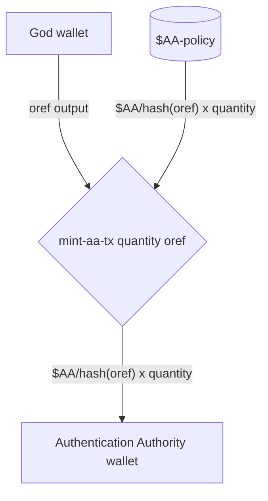
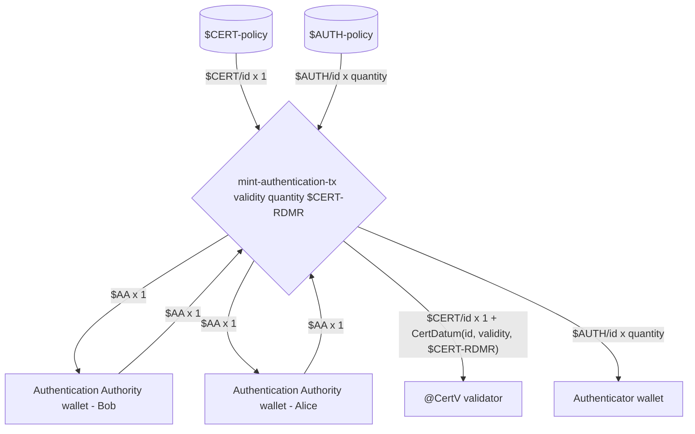
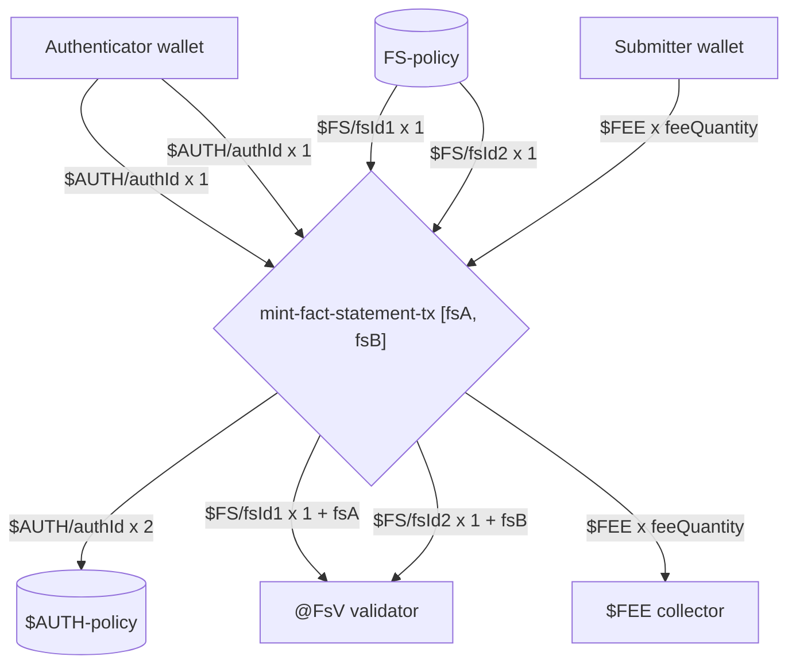
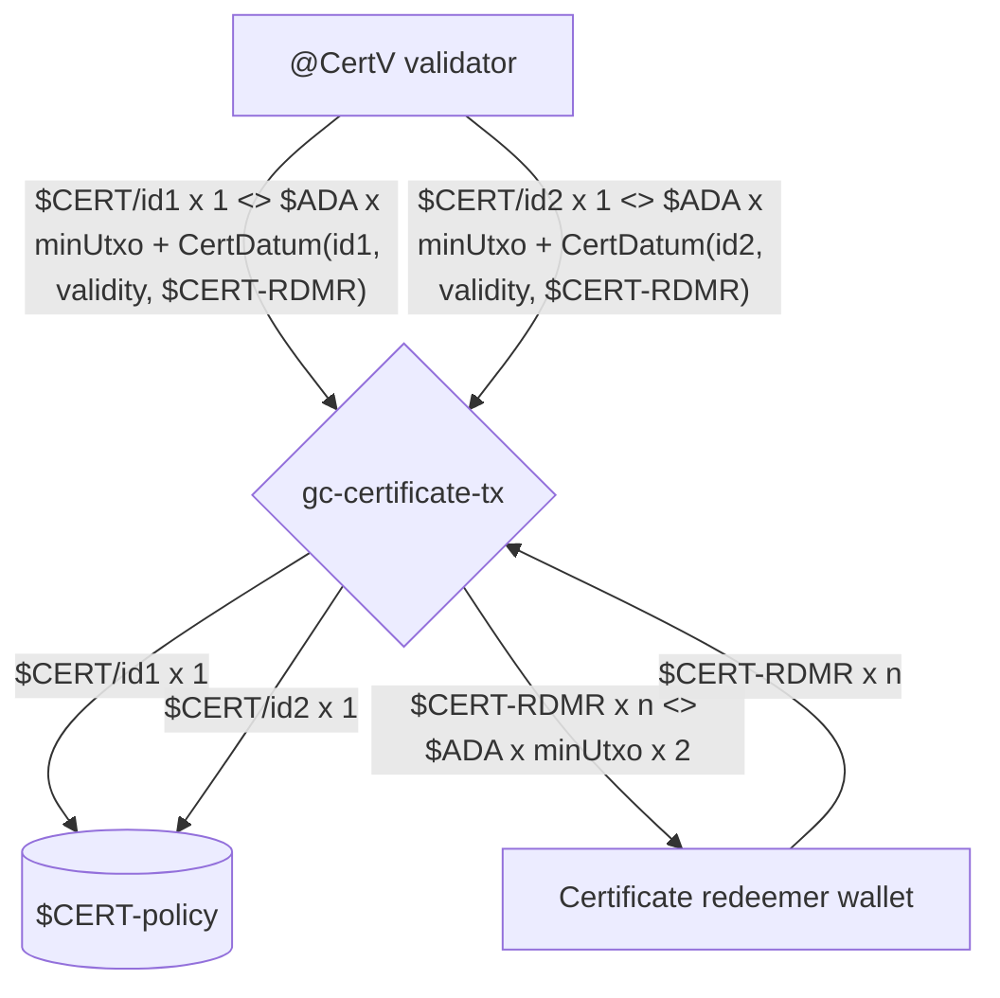
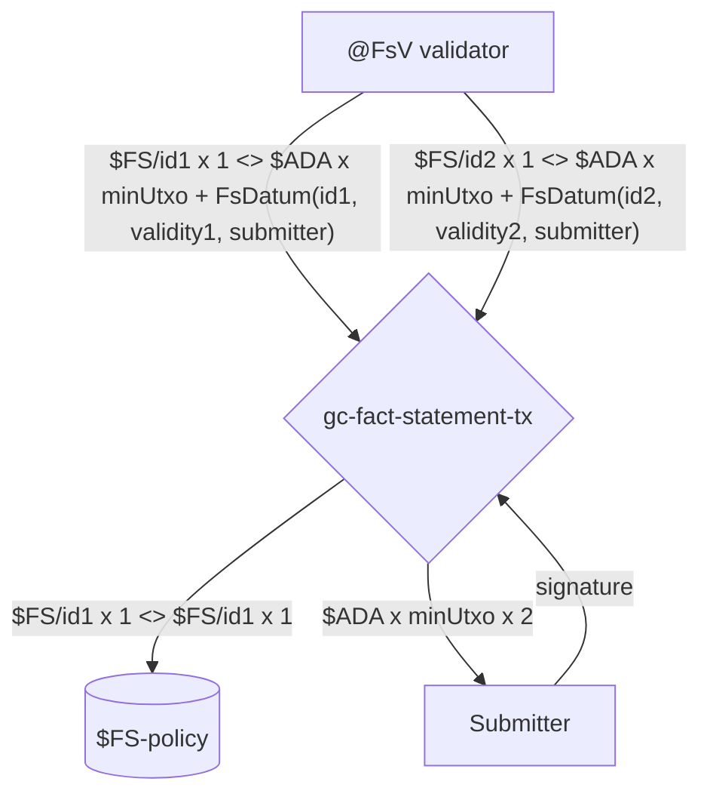
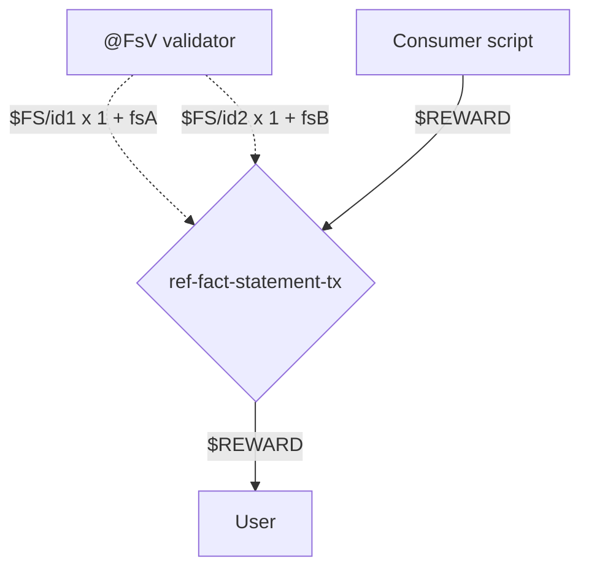

# COOP Plutus protocol

## Protocol parameters

Parameters used at Protocol Genesis.

### <a name="total-aa-tokens">Total Authorization Authority tokens</a>

Total quantity of [$AA](#aa-token) tokens to mint.
These tokens can be distributed to any number of [Authentication Authority](#authentication-authority) wallets to provide:

1. Backup and redundancy in case of loss,
2. Multi-signature scheme for [minting authentication tokens](#mint-authentication-tx).

### <a name="required-aa-tokens">Required Authorization Authority tokens</a>

Required quantity of [$AA](#aa-token) tokens that must be consumed when [minting authentication tokens](#mint-authentication-tx).
These tokens can be in one or many inputs, enabling multi-signature scheme to be adopted.

## <a name="transactions">Transactions</a>

### <a name="mint-aa-tx">Mint $AA 'One Shot' tokens - mint-aa-tx</a>

**Scripts invoked:**

- [$AA-policy](#aa-policy)

**Signatories:**

- [God](#god)

**Scenario:**

[God](#god) mints [$AA](#aa-token) tokens and sends them to a single [Authentication Authority](#authentication-authority).



The `TokenName` of the [$AA](#aa-token) token is set to a hash of the input pointed to by `oref` (see [Hashing inputs for uniqueness](#hashing-for-uniqueness)).

### <a name="mint-authentication-tx">Mint authentication tokens - mint-authentication-tx</a>

**Scripts invoked:**

- [$AUTH-policy](#auth-policy)
- [$CERT-policy](#cert-policy)

**Signatories:**

- Bob [Authentication Authority](#authentication-authority)
- Alice [Authentication Authority](#authentication-authority)

**Scenario:**

Bob and Alice are [Authentication Authority](#authentication-authority) and they mint authentication by minting a [$CERT](#cert-token) token and paying it to the [@CertV](#cert-validator) validator, and minting [$AUTH](#auth-token) x `quantity` tokens and paying them to a single [Authenticator](#authenticator).



`id` is computed by hashing [$AA](#aa-token) inputs consumed (see [Hashing inputs for uniqueness](#hashing-for-uniqueness)).

> The quantity of [$AA](#aa-token) tokens required is determined by the [Required Authorization Authority tokens](#required-aa-tokens) protocol parameter.

### <a name="mint-fact-statement-tx">Mint Fact Statement - mint-fact-statement-tx</a>

**Scripts invoked:**

- [$FS-policy](#fs-policy)
- [$AUTH-policy](#auth-policy)

**Signatories:**

- [Authenticator](#authenticator)
- [Submitter](#submitter)

**Scenario:**

[Submitter](#submitter) publishes two `Fact Statements`, namely `fsA` and `fsB`, within a single transaction.
[Authenticator](#authenticator) provides [$AUTH](#auth-token) tokens for each of the published `Fact Statement` and adds a [$FEE](#fee-token) that will be paid by the [Submitter](#submitter) to the [Fee Collector](#fee-collector).
The `Fact Statements` are made available as UTxOs at the [@FsV](#fs-validator) validator for future referencing in [ref-fact-statement-tx](#ref-fact-statement-tx) transactions.



`fsA` and `fsB` transaction parameters are isomorphic to `FsDatum` in that they contain a `Fact Statement`, along with its unique `Fact Statement ID` as provided by the Oracle's `Fact Statement Store`, the validity information and the [Submitter](#submitter) public key hash.
The `fsId1` and `fsId2` are computed by hashing corresponding [$AUTH](#auth-token) inputs used to authenticate each produced `Fact Statement` (see [Hashing inputs for uniqueness](#hashing-for-uniqueness)).

### <a name="gc-certificate-tx">Garbage collect obsolete certificate - gc-certificate-tx</a>

**Scripts invoked:**

- [$CERT-policy](#cert-policy)

**Signatories:**

- [Certificate redeemer](#certificate-redeemer)

**Scenario:**

[Certificate redeemer](#certificate-redeemer) garbage collects obsolete certificates from [@CertV](#cert-validator) validator and reclaims the [Min UTxO Ada](https://docs.cardano.org/native-tokens/minimum-ada-value-requirement) held within.
`CertDatum` indicates which [$CERT-RDMR](#cert-rdmr-token) token must be spend in order to garbage collect an obsolete certificate.



[$CERT-RDMR](#cert-rdmr-token) tokens are sent back to the [Certificate redeemer](#certificate-redeemer) and all obsolete [$CERT](#cert-token) tokens are burned.

### <a name="gc-fact-statement-tx">Garbage collect obsolete fact statement - gc-fact-statement-tx</a>

**Scripts invoked:**

- [$FS-policy](#fs-policy)

**Signatories:**

- [Submitter](#submitter)

**Scenario:**

The original [Submitter](#submitter) of the [mint-fact-statement-tx](#mint-fact-statement-tx) transaction, as indicated in the `FsDatum`, garbage collects the obsolete `Fact Statement UTxOs` available at [@FsV](#fs-validator).



### <a name="ref-fact-statement-tx">Reference fact statement - ref-fact-statement-tx</a>

**Scripts invoked:**

- [Consumer script](#consumer-script)

**Signatories:**

- As required by the [Consumer script](#consumer-script)

**Scenario:**

User unlocks a reward by referencing two `Fact Statements`, namely `fsA` and `fsB`, and consumes a reward input from the [Consumer script](#consumer-script) that they pay to themselves.



> The [Consumer script](#consumer-script) must check that the referenced [@FsV](#fs-validator) validator inputs containing `Fact Statements` have the expected [$FS](#fs-token) `CurrencySymbol`.

## <a name="tokens">Tokens</a>

### <a name="aa-token">Authentication Authority token - $AA</a>

- Policy - [$AA-policy](#aa-policy)
- Token Name - is set to a hash of the consumed output denoted by `oref` (see [Hashing inputs for uniqueness](#hashing-for-uniqueness)),
- Quantity - the total [$AA](#aa-token) tokens minted at protocol genesis (see [Total Authorization Authority tokens](#total-aa-tokens) protocol parameter),
- Provenance - must be held by [Authentication Authority](#authentication-authority) wallets and kept safe in an isolated environment
  - Minted with [mint-aa-tx](#mint-aa-tx) transaction,
  - Burned never,
  - Used in [mint-authentication-tx](#mint-authentication-tx) transactions.

### <a name="cert-token">Certificate token - $CERT</a>

- Policy - [$CERT-policy](#cert-policy)
- Token Name - is set to a hash of the consumed [$AA](#aa-token) inputs (see [Hashing inputs for uniqueness](#hashing-for-uniqueness)),
- Quantity - Each [$CERT](#cert-token) token is unique and only 1 such token exists at any point in time. However, collectively there can be zero or more [$CERT](#cert-token) tokens in the protocol at any time,
- Provenance - held at [@CertV](#cert-validator) validator
  - Minted with [mint-authentication-tx](#mint-authentication-tx) transaction,
  - Burned with [gc-certificate-tx][#gc-certificate-tx] transaction,
  - Used to authenticate [@CertV][#cert-validator] validator reference inputs in [mint-fact-statement-tx](#mint-fact-statement-tx) transaction.

### <a name="cert-rdmr-token">Certificate redeemer token - $CERT-RDMR</a>

Self managed token, the Protocol Design doesn't enforce how these tokens are obtained.
For convenience, the implementation enables Protocol Operators to mint 'One Shot' tokens to be used as `$CERT-RMDR` tokens.

These tokens are used in [gc-certificate-tx](#gc-certificate-tx) transactions to authenticate garbage collection of obsolete certificates.

### <a name="auth-token">Authentication token - $AUTH</a>

- Policy - [$AUTH-policy](#auth-policy)
- Token Name - is set to a hash of the consumed [$AA](#aa-token) inputs (see [Hashing inputs for uniqueness](#hashing-for-uniqueness)),
- Quantity - [$AUTH](#auth-token) tokens are minted in batch and their quantity is determined by the `Protocol Operator`. However, each batch shares the same unique token name,
- Provenance - held at [Authenticator](#authenticator) wallet
  - Minted with [mint-authentication-tx](#mint-authentication-tx) transaction,
  - Burned with [mint-fact-statement-tx](#mint-fact-statement-tx) transaction.

### <a name="fs-token">Fact statement token - $FS</a>

- Policy - [$FS-policy](#fs-policy)
- Token Name - is set to a hash of the consumed [$AUTH](#auth-token) input used to authenticate a `Fact Statement` (see [Hashing inputs for uniqueness](#hashing-for-uniqueness)),
- Quantity - Each token is unique and there can be zero or more such tokens in the protocol at any point in time,
- Provenance - held at [#FsV](#fs-validator) validator
  - Minted with [mint-fact-statement-tx](#mint-fact-statement-tx) transaction,
  - Burned with [gc-fact-statement-tx](#gc-fact-statement-tx) transaction.
  - Used to authenticate [@FsV][#fs-validator] validator reference inputs in [ref-fact-statement-tx](#ref-fact-statement-tx) transaction.

> This token is used by COOP Consumers to authenticate the Fact Statement reference inputs.

### <a name="fee-token">Fee token - $FEE</a>

Any token the `Protocol Operator` wishes to use as a 'fee', which includes but is not exclusive to `$ADA`.

These tokens are spent from [Submitter](#submitter) wallets and paid to the [Fee Collector](#fee-collector) in [mint-fact-statement-tx](#mint-fact-statement-tx) transactions.

## <a name="scripts">Scripts</a>

### <a name="aa-policy">$AA-policy</a>

[$AA](#aa-token) minting policy script that validates minting of 'One Shot' [Authentication Authority](#authentication-authority) (ie. [$AA](#aa-token)) tokens in [minting authentication authority tokens](#mint-aa-tx) transaction.

Policy is implemented as `Coop.Plutus.Aux.mkOneShotMp quantity tokenName oref` such that

- `quantity` denotes the [total amount of [$AA](#aa-token) tokens to mint](#total-aa-tokens),
- `tokenName` is set to a [hash of the of the 'oref' output](#hashing-for-uniqueness),
- `oref` the output owned by the [Authentication Authority](#authentication-authority) wallet that must be consumed in order to validate minting.

Validation rules:

- check that a specified `TxOutRef` is consumed,
- check that a specified quantity of tokens with a specified token name are minted,
- no paying requirements are enforced.

### <a name="cert-policy">$CERT-policy</a>

[$CERT](#cert-token) minting policy script that validates minting of [$CERT](#cert-token) tokens in [minting authentication](#mint-authentication-tx) transactions.

Policy is defined in `Coop.Plutus.mkCertMp` and is instantiated with the `CertMpParams` parameter:

```haskell
-- | CertMp initial parameters
data CertMpParams = CertMpParams
  { cmp'authAuthorityAc :: AssetClass
  -- ^ $AA (Authentication authority) tokens required to authorize $CERT minting
  , cmp'requiredAtLeastAaQ :: Integer
  -- ^ $AA token quantity required to authorize $CERT minting
  , cmp'certVAddress :: Address
  -- ^ Certificate validator @CertV address to pay the $CERT tokens to
  }
```

Policy support two redeemers:

```haskell
-- | CertMp redeemer denoting $CERT mint or burning actions
data CertMpRedeemer = CertMpBurn | CertMpMint
```

Policy works with `CertDatum` datum:

```haskell
-- | Datum locked at @CertV containing information about $AUTH tokens used in authorizing $FS minting
data CertDatum = CertDatum
  { cert'id :: LedgerBytes
  -- ^ Certificate unique identifier (matches $CERT and $AUTH token names)
  , cert'validity :: POSIXTimeRange
  -- ^ Certificate validity interval after which associated $AUTH tokens can't be used to authorize $FS minting
  , cert'redeemerAc :: AssetClass
  -- ^ $CERT-RMDR asset class that must be spent to 'garbage collect' the @CertV UTxO after the certificate had expired
  }
```

Validation rules for minting [$CERT](#cert-token) tokens:

- `CertMpMint` redeemer is used,
- check that the `CertMpParams.cmp'requiredAtLeastAaQ` quantity of `CertMpParams.cmp'authAuthorityAc` are spent (See [Required Authorization Authority tokens](#required-aa-tokens)),
- accumulate and hash [$AA](#aa-token) inputs consumed into a [unique token name](#hashing-for-uniqueness) to use for the [$CERT](#cert-token) token minted,
- check that `$CERT x 1` is paid to [@CertV](#cert-validator) validator as indicated in `CertMpParams.cmp'certVAddress`,
- check that [$CERT](#cert-token) output at [@CertV](#cert-validator) contains a `CertDatum` such that `CertDatum.cert'id` matches the previously constructed unique token name.

Validation rules for burning [$CERT](#cert-token) tokens:

- `CertMpBurn` redeemer is used,
- for `n` consumed input containing the [$CERT](#cert-token) token,
  - check the transaction validates after the certificate validity period as indicated in the `CertDatum.cert'validity` field of the consumed datum,
  - check that `$CERT-RDMR x 1` value as specified in the `CertDatum.cert'redeemerAc` is spent,
  - accumulate the spent `$CERT x 1` value to burn,
- check that all the spent `$CERT x n` are also burned
- no paying requirements are enforced for [$CERT-RDMR](#cert-rdmr-token) tokens.

### <a name="cert-validator">@CertV</a>

### <a name="auth-policy">$AUTH-policy</a>

### <a name="fs-policy">$FS-policy</a>

### <a name="fs-validator">@FsV</a>

### <a name="consumer-script">Consumer script</a>

## <a name="wallets">Wallets</a>

### <a name="god">God</a>

A wallet used to initialize the protocol (ie. Protocol Genesis). Can be discarded after use.

### <a name="authentication-authority">Authentication Authority</a>

[Authentication Authority](#authentication-authority) wallets holding [$AA](#aa-token) tokens used to authenticate [minting ephemeral authentication tokens](#mint-authentication-tx).
Note that there can be any number of such wallets and it's left to the `Protocol Operator` to manage their distribution.

> Must be held in a safe environment as compromising $AA wallets can undermine the entire protocol.

### <a name="authenticator">Authenticator</a>

[Authenticator](#authenticator) wallets hold the [$AUTH](#auth-token) ephemeral tokens that are attached to each [Fact Statement minting](#mint-fact-statement-tx)
transaction to denote 'authentication' by the `Publisher`.

`Authenticators` are used extensively by the Fact Statement publishing backend and as such should be kept safe. However, unlike the [Authentication Authority](#authentication-authority) wallets, if compromised these wallets only impact the integrity of the Protocol for the duration of [$AUTH](#auth-token) tokens held within. After that point compromised wallets can be discarded and replaced with fresh ones, which would then receive new [$AUTH](#auth-token) tokens.

> Protocol Operators manage how many [$AUTH](#auth-token) tokens are minted, how long they are valid and which Authenticator wallets will receive them.

### <a name="submitter">Submitter</a>

[Submitter](#submitter) is a wallet used by the user that submits the [Fact Statement minting transactions](#mint-fact-statement-tx) transaction obtained in the `Fact Statement Publishing` protocol.

The wallet needs to provide enough [$FEE](#fee-token) tokens as indicated in the `Fact Statement Publishing` protocol.

### <a name="certificate-redeemer">Certificate redeemer</a>

[Certificate redeemer](#certificate-redeemer) wallets hold the [$CERT-RDMR](#cert-rdmr-token) tokens and are managed by the `Protocol Operator` similar to how [Authenticator](#authenticator) wallets are managed.
In fact, both wallets can be consolidated in a single wallet for convenience.

Certificate redeemer wallets are in charge of [garbage collecting obsolete certificates](#gc-certificates-tx) by providing the corresponding [$CERT-RDMR](#cert-rdmr-token) tokens as indicated in the `CertDatum`.

### <a name="fee-collector">Fee collector</a>

`Fee collector` is any wallet or validator the `Protocol Operator` decides to use to collect [$FEE](#fee-token) tokens in [Fact Statement minting transactions](#mint-fact-statement-tx).

## Appendix

### <a name="transaction-diagram-notation">Transaction diagram notation</a>

Transaction diagrams are specified using the [Mermaid Sequence Diagrams](https://mermaid-js.github.io/mermaid/#/sequenceDiagram).

Sequence diagram element description:

- Rectangle - Something with an Address (Validator or Wallet),
- Pool - A minting policy,
- Diamond - Transaction (sometimes with parameters),
- Line
  - Consumes TxOut if going from an Address (Rectangle),
  - Mints a value if going from a Minting Policy (Pool),
  - Burns a value if going to a Minting Policy (Pool),
  - Provides a signature if going from a Wallet
- Dotted - references TxOut

#### Textual notation used

##### Values

A `Token` is a tuple of `CurrencySymbol` and `TokenName` (also knows as `AssetClass`).

```bnf
Value --> Token x Quantity [<> Token x Quantity]
Token --> $CurrencySymbol/TokenName | $CurrencySymbol
CurrencySymbol --> <all caps with dashes>
TokenName --> <any>
```

For brevity the `TokenName` can be ommitted when appropriate.

Examples:

- `$ADA x 1`
- `$ADA x q`
- `$FOO x 1`
- `$FOO/bar x q <> $ADA x minUtxoAda`

##### Inputs and outputs

```bnf
IO --> Value + Datum
Datum --> <some record/product notation>
```

Examples:

- `$FOO/bar x q <> $ADA x minUtxoAda + MyDatum(foo=1, bar=2)`

##### Transaction

```bnf
Transaction --> TransactionName [Parameters]
Parameters --> Parameter [Parameters]
TransactionName --> <lowercase with dashes>
Parameter --> <camelCase>
```

Examples:

- `mint-sometokens-tx quantity tokenName`
- `always-validates-tx`

## References

- [Eternal keys considered harmful #34](https://github.com/mlabs-haskell/cardano-open-oracle-protocol/issues/34)
