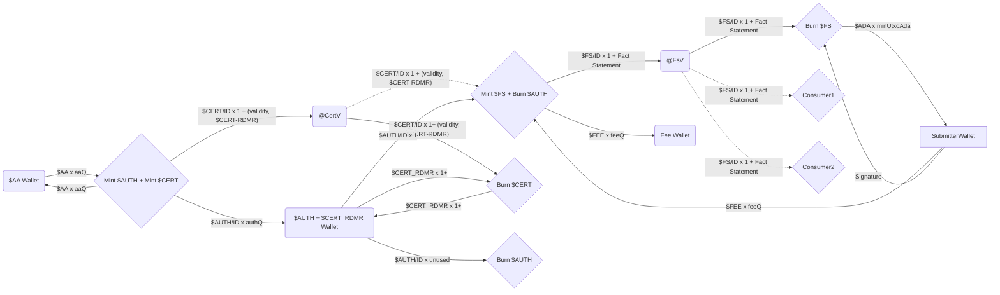

# COOP onchain architecture

Legend:

- Rectangle - something with an Address (Validator or Wallet)
- Diamond - transaction
- Line - consumes TxOut
- Dotted - references TxOut
- $CurrencySymbol/TokenName x Quantity + Datum

## Tokens

### Authentication authority token - $AA

### Certificate token - $CERT

### Certificate redeemer token - $CERT-RDMR

> INFO[Andrea]: instead of a $CERT-RDMR token you could just have a
> PKH in the @CertV datum, and check the burn $CERT transaction is
> signed by that, like you do for burning $FS tokens and submitters.
> This would only grant the PKH access to a small amount of Ada, so it
> does not seem like the extra token indirection is warranted.

### Authentication token - $AUTH

### Fact statement token - $FS

## Scripts

### CertMp

### @CertV

### AuthMp

### FsMp

### @FsV

## Wallets

### God wallet

### $AA wallet

### $AUTH and $CERT-RDMR wallet

### $FEE wallet

## References

- [Eternal keys considered harmful #34](https://github.com/mlabs-haskell/cardano-open-oracle-protocol/issues/34)
