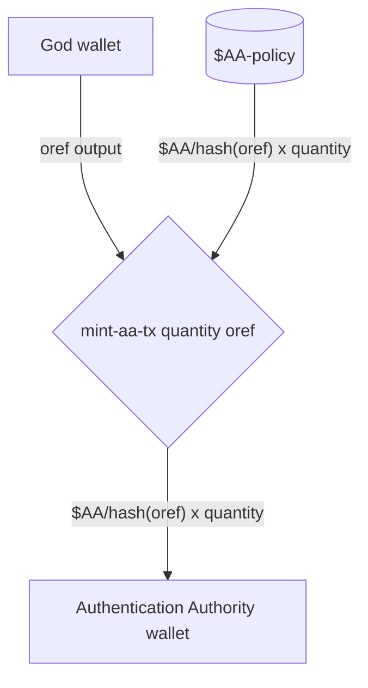
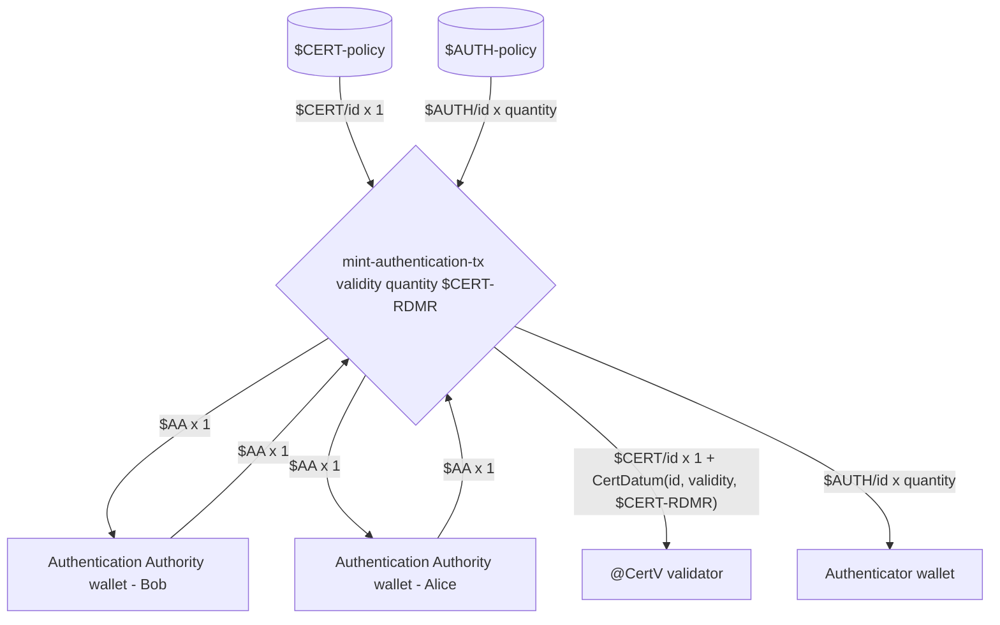
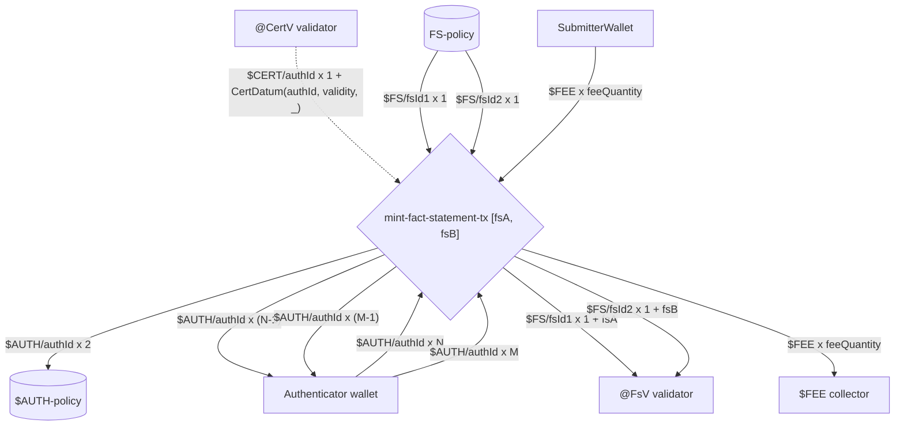
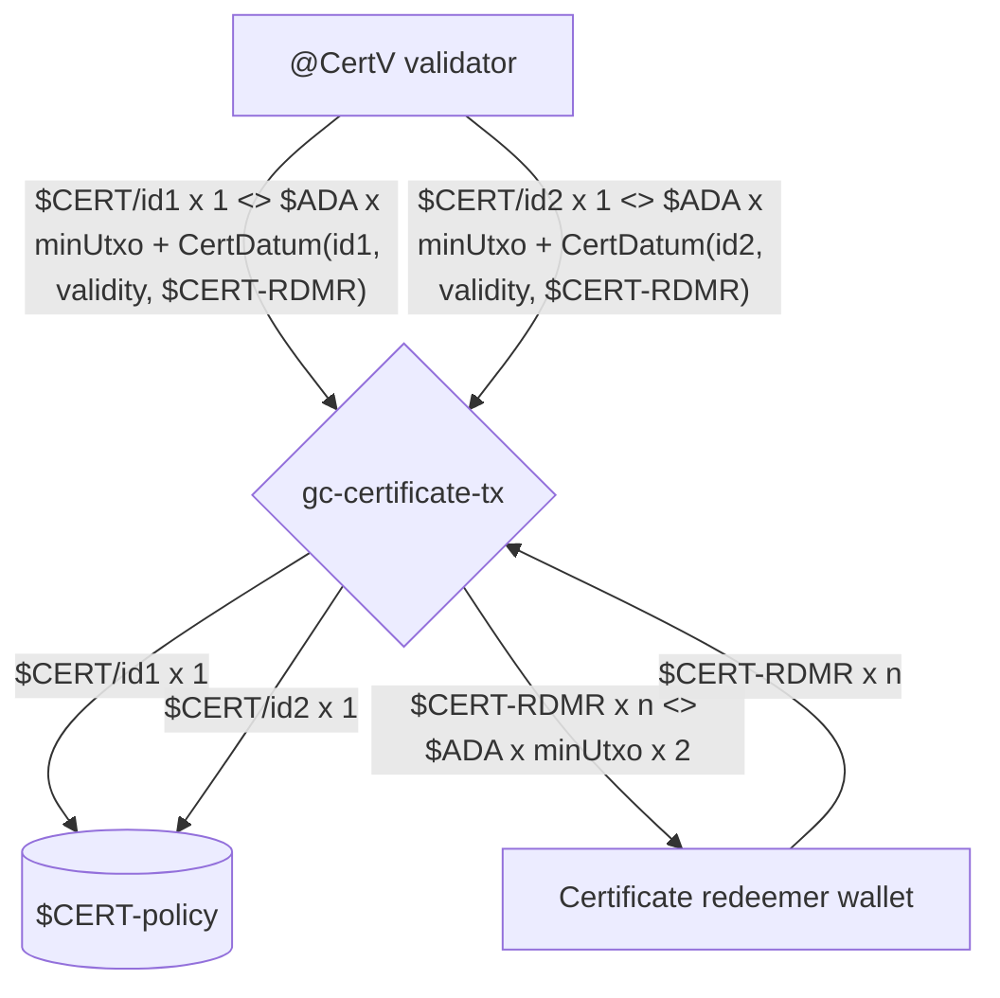
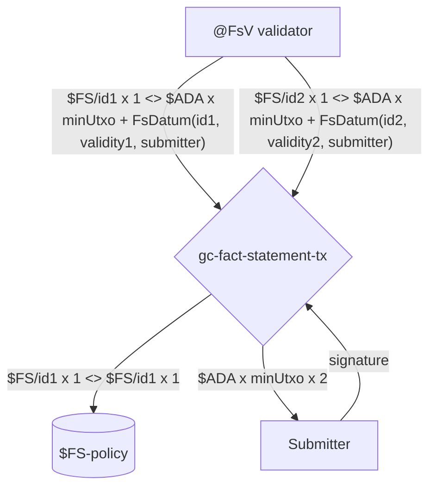
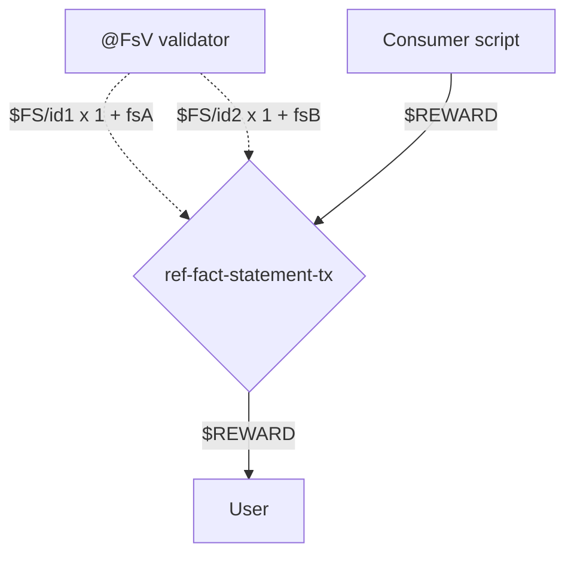

# COOP Plutus protocol

This document contains information about all the wallets, tokens, minting policies, validators and transactions used in COOP and their relationship.

## Protocol parameters

Parameters set at [Protocol genesis](#protocol-genesis).

### <a id="total-aa-tokens">Total Authentication Authority tokens</a>

Total quantity of [$AA](#aa-token) tokens to mint.
These tokens can be distributed to any number of [Authentication Authority](#authentication-authority) wallets to provide:

1. Backup and redundancy in case of loss,
2. Multi-signature scheme for [minting authentication tokens](#mint-authentication-tx).

### <a id="required-aa-tokens">Required Authentication Authority tokens</a>

Required quantity of [$AA](#aa-token) tokens that must be consumed when [minting authentication tokens](#mint-authentication-tx).
These tokens can be in one or many inputs, enabling multi-signature scheme to be adopted.

## <a id="protocol-genesis">Protocol genesis</a>

To following is instantiated by [God](#god):

1. [@FsV](#fs-validator) validator script,
2. [@CertV](#cert-validator) validator script,
3. [$CERT-policy](#cert-policy) minting policy script,
4. [$AUTH-policy](#auth-policy) minting policy script,
5. [$FS-policy](#fs-policy) minting policy script.

## Protocol state

To understand the state of the Protocol it's sufficient to query the UTxOs at:

1. [@CertV](#cert-validator) validator that holds the non-garbage-collected certificates,
2. [@FsV](#fs-validator) validator that holds the non-garbage-collected fact statements.

TODO: Add a relational schema to convey the state structure and semantics.

## <a id="transactions">Transactions</a>

### <a id="mint-aa-tx">Mint $AA 'One Shot' tokens - mint-aa-tx</a>

**Scripts invoked:**

- [$AA-policy](#aa-policy)

**Signatories:**

- [God](#god)

**Scenario:**

[God](#god) mints [$AA](#aa-token) tokens and sends them to a single [Authentication Authority](#authentication-authority).



The `TokenName` of the [$AA](#aa-token) token is set to a hash of the input pointed to by `oref` (see [Hashing inputs for uniqueness](#hashing-for-uniqueness)).

### <a id="mint-authentication-tx">Mint authentication tokens - mint-authentication-tx</a>

**Scripts invoked:**

- [$AUTH-policy](#auth-policy)
- [$CERT-policy](#cert-policy)

**Signatories:**

- Bob [Authentication Authority](#authentication-authority)
- Alice [Authentication Authority](#authentication-authority)

**Scenario:**

Bob and Alice are [Authentication Authority](#authentication-authority) and they mint authentication by minting a [$CERT](#cert-token) token and paying it to the [@CertV](#cert-validator) validator, and minting [$AUTH](#auth-token) x `quantity` tokens and paying them to a single [Authenticator](#authenticator).



`id` is computed by hashing [$AA](#aa-token) inputs consumed (see [Hashing inputs for uniqueness](#hashing-for-uniqueness)).

> The quantity of [$AA](#aa-token) tokens required is determined by the [Required Authentication Authority tokens](#required-aa-tokens) protocol parameter.

### <a id="mint-fact-statement-tx">Mint Fact Statement - mint-fact-statement-tx</a>

**Scripts invoked:**

- [$FS-policy](#fs-policy)
- [$AUTH-policy](#auth-policy)

**Signatories:**

- [Authenticator](#authenticator)
- [Submitter](#submitter)

**Scenario:**

[Submitter](#submitter) publishes two `Fact Statements`, namely `fsA` and `fsB`, within a single transaction.
[Authenticator](#authenticator) provides [$AUTH](#auth-token) tokens for each of the published `Fact Statement` and adds a [$FEE](#fee-token) that will be paid by the [Submitter](#submitter) to the [Fee Collector](#fee-collector).
The `Fact Statements` are made available as UTxOs at the [@FsV](#fs-validator) validator for future referencing in [ref-fact-statement-tx](#ref-fact-statement-tx) transactions.



`fsA` and `fsB` transaction parameters are isomorphic to `FsDatum` in that they contain a `Fact Statement`, along with its unique `Fact Statement ID` as provided by the Oracle's `Fact Statement Store`, the validity information and the [Submitter](#submitter) public key hash.
The `fsId1` and `fsId2` are computed by hashing corresponding [$AUTH](#auth-token) inputs used to authenticate each produced `Fact Statement` (see [Hashing inputs for uniqueness](#hashing-for-uniqueness)).

Each [$AUTH](#auth-token) used must be valid, and the validity is asserted by checking the referenced [@CertV](#cert-validator) UTxO.

### <a id="gc-certificate-tx">Garbage collect obsolete certificate - gc-certificate-tx</a>

**Scripts invoked:**

- [$CERT-policy](#cert-policy)

**Signatories:**

- [Certificate redeemer](#certificate-redeemer)

**Scenario:**

[Certificate redeemer](#certificate-redeemer) garbage collects obsolete certificates from [@CertV](#cert-validator) validator and reclaims the [Min UTxO Ada](https://docs.cardano.org/native-tokens/minimum-ada-value-requirement) held within.
`CertDatum` indicates which [$CERT-RDMR](#cert-rdmr-token) token must be spend in order to garbage collect an obsolete certificate.



[$CERT-RDMR](#cert-rdmr-token) tokens are sent back to the [Certificate redeemer](#certificate-redeemer) and all obsolete [$CERT](#cert-token) tokens are burned.

### <a id="gc-fact-statement-tx">Garbage collect obsolete fact statement - gc-fact-statement-tx</a>

**Scripts invoked:**

- [$FS-policy](#fs-policy)

**Signatories:**

- [Submitter](#submitter)

**Scenario:**

The original [Submitter](#submitter) of the [mint-fact-statement-tx](#mint-fact-statement-tx) transaction, as indicated in the `FsDatum`, garbage collects the obsolete `Fact Statement UTxOs` available at [@FsV](#fs-validator).



### <a id="ref-fact-statement-tx">Reference fact statement - ref-fact-statement-tx</a>

**Scripts invoked:**

- [Consumer script](#consumer-script)

**Signatories:**

- As required by the [Consumer script](#consumer-script)

**Scenario:**

User unlocks a reward by referencing two `Fact Statements`, namely `fsA` and `fsB`, and consumes a reward input from the [Consumer script](#consumer-script) that they pay to themselves.



> The [Consumer script](#consumer-script) must check that the referenced [@FsV](#fs-validator) validator inputs containing `Fact Statements` have the expected [$FS](#fs-token) `CurrencySymbol`.

## <a id="tokens">Tokens</a>

### <a id="aa-token">Authentication Authority token - $AA</a>

- Policy - [$AA-policy](#aa-policy)
- Token Name - is set to a hash of the consumed output denoted by `oref` (see [Hashing inputs for uniqueness](#hashing-for-uniqueness)),
- Quantity - the total [$AA](#aa-token) tokens minted at [Protocol genesis](#protocol-genesis) (see [Total Authentication Authority tokens](#total-aa-tokens) protocol parameter),
- Provenance - must be held by [Authentication Authority](#authentication-authority) wallets and kept safe in an isolated environment
  - Minted with [mint-aa-tx](#mint-aa-tx) transaction,
  - Burned never,
  - Used in [mint-authentication-tx](#mint-authentication-tx) transactions.

### <a id="cert-token">Certificate token - $CERT</a>

- Policy - [$CERT-policy](#cert-policy)
- Token Name - is set to a hash of the consumed [$AA](#aa-token) inputs (see [Hashing inputs for uniqueness](#hashing-for-uniqueness)),
- Quantity - Each [$CERT](#cert-token) token is unique and only 1 such token exists at any point in time. However, collectively there can be zero or more [$CERT](#cert-token) tokens in the protocol at any time,
- Provenance - held at [@CertV](#cert-validator) validator
  - Minted with [mint-authentication-tx](#mint-authentication-tx) transaction,
  - Burned with [gc-certificate-tx](#gc-certificate-tx) transaction,
  - Used to authenticate [@CertV](#cert-validator) validator reference inputs in [mint-fact-statement-tx](#mint-fact-statement-tx) transaction.

### <a id="cert-rdmr-token">Certificate redeemer token - $CERT-RDMR</a>

Self managed token, the Protocol Design doesn't enforce how these tokens are obtained.
For convenience, the implementation enables Protocol Operators to mint 'One Shot' tokens to be used as `$CERT-RMDR` tokens.

These tokens are used in [gc-certificate-tx](#gc-certificate-tx) transactions to authenticate garbage collection of obsolete certificates.

### <a id="auth-token">Authentication token - $AUTH</a>

- Policy - [$AUTH-policy](#auth-policy)
- Token Name - is set to a hash of the consumed [$AA](#aa-token) inputs (see [Hashing inputs for uniqueness](#hashing-for-uniqueness)),
- Quantity - [$AUTH](#auth-token) tokens are minted in batch and their quantity is determined by the `Protocol Operator`. However, each batch shares the same unique token name,
- Provenance - held at [Authenticator](#authenticator) wallet
  - Minted with [mint-authentication-tx](#mint-authentication-tx) transaction,
  - Burned with [mint-fact-statement-tx](#mint-fact-statement-tx) transaction.

### <a id="fs-token">Fact statement token - $FS</a>

- Policy - [$FS-policy](#fs-policy)
- Token Name - is set to a hash of the consumed [$AUTH](#auth-token) input used to authenticate a `Fact Statement` (see [Hashing inputs for uniqueness](#hashing-for-uniqueness)),
- Quantity - Each token is unique and there can be zero or more such tokens in the protocol at any point in time,
- Provenance - held at [#FsV](#fs-validator) validator
  - Minted with [mint-fact-statement-tx](#mint-fact-statement-tx) transaction,
  - Burned with [gc-fact-statement-tx](#gc-fact-statement-tx) transaction.
  - Used to authenticate [@FsV](#fs-validator) validator reference inputs in [ref-fact-statement-tx](#ref-fact-statement-tx) transaction.

> This token is used by COOP Consumers to authenticate the Fact Statement reference inputs.

### <a id="fee-token">Fee token - $FEE</a>

Any token the `Protocol Operator` wishes to use as a 'fee', which includes but is not exclusive to `$ADA`.

These tokens are spent from [Submitter](#submitter) wallets and paid to the [Fee Collector](#fee-collector) in [mint-fact-statement-tx](#mint-fact-statement-tx) transactions.

## <a id="scripts">Scripts</a>

### <a id="aa-policy">$AA-policy</a>

[$AA](#aa-token) minting policy script.

Script is defined in `Coop.Plutus.Aux.mkOneShotMp` and is instantiated at [Protocol genesis](#protocol-genesis) with the following parameters:

- `quantity` denotes the [total amount of [$AA](#aa-token) tokens to mint](#total-aa-tokens),
- `tokenName` is set to a [hash of the of the 'oref' output](#hashing-for-uniqueness),
- `oref` the output owned by the [God](#god) wallet that must be consumed in order to validate minting.

Participates in transactions:

- [mint-aa-tx](#mint-aa-tx) mints [$AA](#aa-token) tokens and pays them to the [Authentication Authority](#authentication-authority).

Script is invoked only once at [Protocol genesis](#protocol-genesis).

### <a id="cert-policy">$CERT-policy</a>

[$CERT](#cert-token) minting policy script.

Script is defined in `Coop.Plutus.mkCertMp` and is instantiated at [Protocol genesis](#protocol-genesis) with the `Coop.Types.CertMpParams` parameter.

Participates in transactions:

- [mint-authentication-tx](#mint-authentication-tx) mints [$CERT](#cert-token) tokens and pays them to the [@CertV](#cert-validator) validator,
- [gc-certificate-tx](#gc-certificate-tx) burns [$CERT](#cert-token) tokens spent from to the [@CertV](#cert-validator) validator.

Script is invoked throughout the Protocol lifetime.

### <a id="auth-policy">$AUTH-policy</a>

[$AUTH](#auth-token) minting policy script.

Script is defined in `Coop.Plutus.mkAuthMp` and is instantiated at [Protocol genesis](#protocol-genesis) with the `Coop.Types.AuthMpParams` parameter.

Participates in transactions:

- [mint-authentication-tx](#mint-authentication-tx) mints [$AUTH](#auth-token) tokens and pays them to the [Authenticator](#authenticator) wallet,
- [mint-fact-statement-tx](#mint-fact-statement-tx) burns [$AUTH](#auth-token) tokens spent from [Authenticator](#authenticator) wallet.

Scripts is invoked throughout the Protocol lifetime.

### <a id="fs-policy">$FS-policy</a>

[$FS](#fs-token) minting policy script.

Script is defined in `Coop.Plutus.mkFsMp` and is instantiated at [Protocol genesis](#protocol-genesis) with the `Coop.Types.FsMpParams` parameter.

Participates in transactions:

- [mint-fact-statement-tx](#mint-fact-statement-tx) mints [$FS](#fs-token) tokens and pays them to [@FsV](#fs-validator) validator,
- [gc-fact-statement-tx](#gc-fact-statement-tx) burns [$FS](#fs-token) tokens spent from to [@FsV](#fs-validator) validator.

Script is invoked throughout the Protocol lifetime.

### <a id="cert-validator">@CertV</a>

Script is defined in `Coop.Plutus.certV` and is instantiated at [Protocol genesis](#protocol-genesis).

Validator guarding `Certificate UTxOs` that contain:

1. `Coop.Types.CertDatum` datum,
2. [$CERT](#cert-token) token.

Participates in transactions:

- [mint-authentication-tx](#mint-authentication-tx) pays to the `@CertV`,
- [mint-fact-statement-tx](#mint-fact-statement-tx) references the `@CertV` outputs,
- [gc-certificate-tx](#gc-certificate-tx) spends the `@CertV` outputs.

Script is invoked throughout the Protocol lifetime.

### <a id="fs-validator">@FsV</a>

Script is defined in `Coop.Plutus.fsV` and is instantiated at [Protocol genesis](#protocol-genesis).

Validator guarding `Fact Statement UTxOs` that contain:

1. `Coop.Types.FsDatum` datum,
2. [$FS](#fs-token) token.

Participates in transactions:

- [mint-fact-statement-tx](#mint-fact-statement-tx) pays to the `@FsV`,
- [ref-fact-statement-tx](#ref-fact-statement-tx) references the `@FsV` outputs,
- [gc-fact-statement-tx](#gc-fact-statement-tx) spends the `@FsV` outputs.

Script is invoked throughout the Protocol lifetime.

### <a id="consumer-script">Consumer script</a>

Any script that references COOP `Fact Statement UTxOs`.

## <a id="wallets">Wallets</a>

### <a id="god">God</a>

A wallet used to initialize the protocol (ie. [Protocol genesis](#protocol-genesis)). Can be discarded after use.

### <a id="authentication-authority">Authentication Authority</a>

[Authentication Authority](#authentication-authority) wallets holding [$AA](#aa-token) tokens used to authenticate [minting ephemeral authentication tokens](#mint-authentication-tx).
Note that there can be any number of such wallets and it's left to the `Protocol Operator` to manage their distribution.

> Must be held in a safe environment as compromising $AA wallets can undermine the entire protocol.

### <a id="authenticator">Authenticator</a>

[Authenticator](#authenticator) wallets hold the [$AUTH](#auth-token) ephemeral tokens that are attached to each [Fact Statement minting](#mint-fact-statement-tx)
transaction to denote 'authentication' by the `Publisher`.

`Authenticators` are used extensively by the Fact Statement publishing backend and as such should be kept safe. However, unlike the [Authentication Authority](#authentication-authority) wallets, if compromised these wallets only impact the integrity of the Protocol for the duration of [$AUTH](#auth-token) tokens held within. After that point compromised wallets can be discarded and replaced with fresh ones, which would then receive new [$AUTH](#auth-token) tokens.

> Protocol Operators manage how many [$AUTH](#auth-token) tokens are minted, how long they are valid and which Authenticator wallets will receive them.

### <a id="submitter">Submitter</a>

[Submitter](#submitter) is a wallet used by the user that submits the [Fact Statement minting transactions](#mint-fact-statement-tx) transaction obtained in the `Fact Statement Publishing` protocol.

The wallet needs to provide enough [$FEE](#fee-token) tokens as indicated in the `Fact Statement Publishing` protocol.

### <a id="certificate-redeemer">Certificate redeemer</a>

[Certificate redeemer](#certificate-redeemer) wallets hold the [$CERT-RDMR](#cert-rdmr-token) tokens and are managed by the `Protocol Operator` similar to how [Authenticator](#authenticator) wallets are managed.
In fact, both wallets can be consolidated in a single wallet for convenience.

Certificate redeemer wallets are in charge of [garbage collecting obsolete certificates](#gc-certificate-tx) by providing the corresponding [$CERT-RDMR](#cert-rdmr-token) tokens as indicated in the `CertDatum`.

### <a id="fee-collector">Fee collector</a>

`Fee collector` is any wallet or validator the `Protocol Operator` decides to use to collect [$FEE](#fee-token) tokens in [Fact Statement minting transactions](#mint-fact-statement-tx).

## Appendix

### <a id="transaction-diagram-notation">Transaction diagram notation</a>

Transaction diagrams are specified using the [Mermaid Sequence Diagrams](https://mermaid-js.github.io/mermaid/#/sequenceDiagram).

Sequence diagram element description:

- Rectangle - Something with an Address (Validator or Wallet),
- Pool - A minting policy,
- Diamond - Transaction (sometimes with parameters),
- Line
  - Consumes TxOut if going from an Address (Rectangle),
  - Mints a value if going from a Minting Policy (Pool),
  - Burns a value if going to a Minting Policy (Pool),
  - Provides a signature if going from a Wallet
- Dotted - references TxOut

#### Textual notation used

##### Values

A `Token` is a tuple of `CurrencySymbol` and `TokenName` (also knows as `AssetClass`).

```bnf
Value --> Token x Quantity [<> Token x Quantity]
Token --> $CurrencySymbol/TokenName | $CurrencySymbol
CurrencySymbol --> <all caps with dashes>
TokenName --> <any>
```

For brevity the `TokenName` can be ommitted when appropriate.

Examples:

- `$ADA x 1`
- `$ADA x q`
- `$FOO x 1`
- `$FOO/bar x q <> $ADA x minUtxoAda`

##### Inputs and outputs

```bnf
IO --> Value + Datum
Datum --> <some record/product notation>
```

Examples:

- `$FOO/bar x q <> $ADA x minUtxoAda + MyDatum(foo=1, bar=2)`

##### Transaction

```bnf
Transaction --> TransactionName [Parameters]
Parameters --> Parameter [Parameters]
TransactionName --> <lowercase with dashes>
Parameter --> <camelCase>
```

Examples:

- `mint-sometokens-tx quantity tokenName`
- `always-validates-tx`

### <a id="hashing-for-uniqueness">Hashing inputs for uniqueness</a>

Here we specify the procedure used by `COOP` to create unique identifiers on-chain.
Once created these are used as `TokenName` and various identifiers.

The procedure takes in a list of output references and returns a unique bytestring:

1. Given a list of output references denoted as `orefs :: [(TxId, Int)]`,
2. Order `orefs` to create `sortedOrefs :: [(TxId, Int)]`,
3. Convert `TxId` and `OutputIndex` in `sortedOrefs` to a bytestring format to create `sortedOrefsB :: [(ByteString, ByteString)]`,
4. Convert `sortedOrefsB` to a bytestring format by concatenating all the elements to create `normalized :: Bytestring`,
5. Hash that `normalized` bytestring with [Blake2b_256](https://hackage.haskell.org/package/cryptonite-0.30/docs/Crypto-Hash-Algorithms.html#t:Blake2b_256) to create `unique :: ByteString`,
6. Return `unique` bytestring.

This procedure is implemented in `Coop.Pab.Aux.hashTxInputs` function used off-chain, and `Coop.Plutus.Aux.hashTxInputs` function used on-chain.

## References

- [Eternal keys considered harmful #34](https://github.com/mlabs-haskell/cardano-open-oracle-protocol/issues/34)
