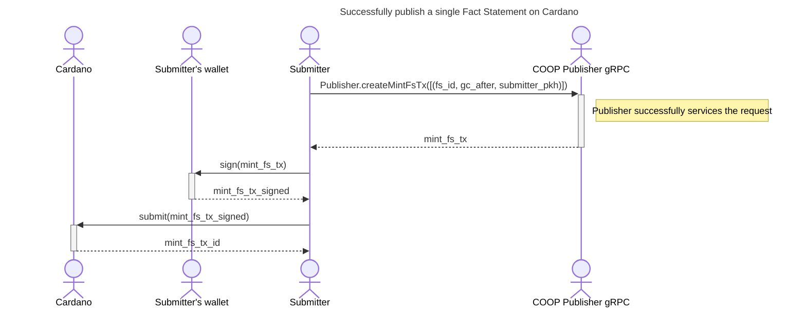
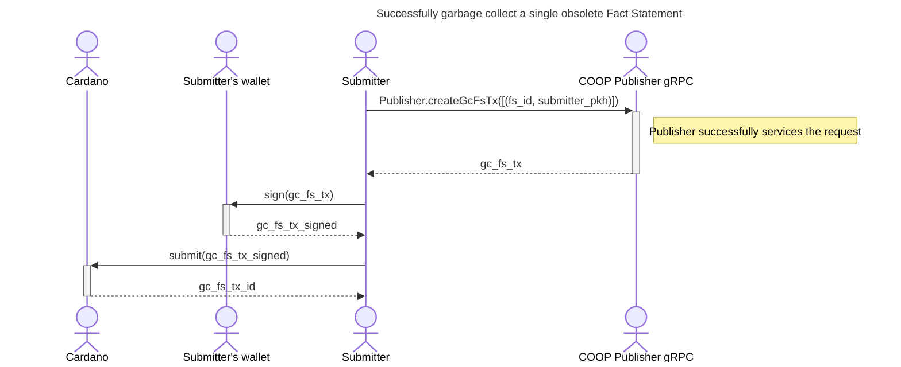

# COOP Frontend protocol

This document contains a information about how users must interact with the COOP Publisher in order to publish new Fact Statements and garbage collect obsolete Fact Statements.

## Publishing a Fact Statement

The successful result of this operation is a [Fact Statement Publishing transaction](02-plutus-protocol.md#mint-fact-statement-tx).

The user we call `Submitter` approaches the [COOP Publisher gRPC](../coop-proto/publisher-service.proto) service with a Fact Statement identifier that exists in the underlying Oracle's `Fact Statement Store`.

The `Submitter` provides the desired Fact Statement IDs they want published, alongside the validity time after which the produced [Fact Statement UTxOs](02-plutus-protocol.md#fs-validator) cab be garbage collected. Of course, the public key hash of the `Submitter` wallets needs to be provided as well as the back-end transaction building process requires that information to construct the transaction.

The service, if successful, responds with the CBOR+base16 encoded Cardano transaction that can be further signed by the `Submitter` and sent to the network (see [mint-fact-statement-tx](02-plutus-protocol.md#mint-fact-statement-tx)).

> The service will only include Fact Statements in the publishing transaction if they aren't already published.

Anyone can now inspect the [Fact Statement UTxOs](02-plutus-protocol.md#fs-validator) and reference the published Fact Statements (see [ref-fact-statement-tx](02-plutus-protocol.md#mint-fact-statement-tx#ref-fact-statement-tx)).

## Garbage collecting obsolete Fact Statements

The successful result of this operation is a [Fact Statement Garbage Collecting transaction](02-plutus-protocol.md#gc-fact-statement-tx).

The `Submitter` approaches the [COOP Publisher gRPC](../coop-proto/publisher-service.proto) service with a Fact Statement identifier that is published in a [Fact Statement UTxO](02-plutus-protocol.md#fs-validator).

The `Submitter` provides the desired Fact Statement IDs they want garbage collected, along with the public key hash of the `Submitter` wallet that submitted the [Fact Statement Publishing](02-plutus-protocol.md#mint-fact-statement-tx) transaction.

The service, if successful, responds with the CBOR+base16 encoded Cardano transaction that can be further signed by the `Submitter` and sent to the network (see [gc-fact-statement-tx](02-plutus-protocol.md#gc-fact-statement-tx)).

> The Submitter can only garbage collect [Fact Statement UTxOs](02-plutus-protocol.md#fs-validator) that they themselves created with the [Fact Statement Publishing](02-plutus-protocol.md#mint-fact-statement-tx) transaction.
