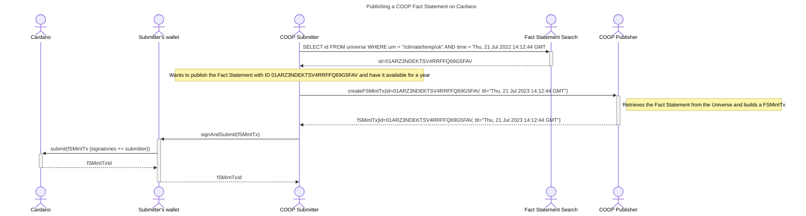

# Publishing a fact statement

**Submitters** provide the **Publisher** with a **Fact Statement ID** (abbr. FSID), a **Fact Statement Time To Live** (abbr. FSTTL), the preferred **Collateral UTxO** and the public key credential the Submitter will use in the last step of this interaction during transaction signing.
The Publisher returns an authenticated **Fact Statement Minting Transaction** (abbr. FSMintTx) that the Submitter must sign and submit to the Cardano ledger.

Submitters acquire FSIDs using a **Fact Statement Search** feature provided by the **Oracle** that manages the **Fact Statement Universe** in which a **Fact Statement** exists (ie. has an assigned FSID).
This feature is not a part of COOP.

FSTTL is also specified by the Submitters, as each Fact Statement UTxO created can be spent by the Submitter after FSTTL has expired enabling them to collect 'min UTxO $ADA'.

The Collateral UTxO is required to be set in all Cardano transaction, and since the Submitter is eventually the one submitting the FSMintTx.

The Publisher retrieves the Fact Statement associated with the provided FSID from the Fact Universe operated by the Oracle, and returns an authenticated FSMintTx for the Submitter to additionally sign and submit to the Cardano ledger.

Once submitted, the FSMintTx creates an **Fact Statement UTxO** (abbr. FSUTxO) on the Cardano ledger that contains the requested Fact Statement in its datum.
FSUTxO can then be referenced by different **Consumers**.
FSUTxO is guaranteed to be available to Consumers until the time specified in FSTTL expires.
The FSMintTx can also include a fee paid to the Publisher.

