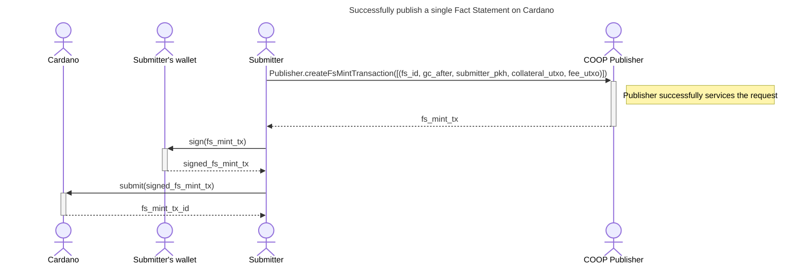
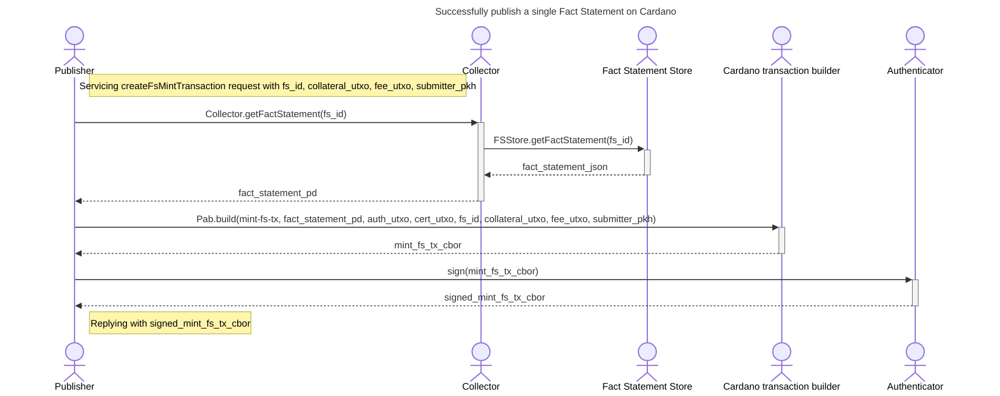

# COOP Publishing protocol

## Frontend protocol

```mermaid
sequenceDiagram
  title Successfully publish a single Fact Statement on Cardano
  actor cardano as Cardano
  actor submitterWallet as Submitter's wallet
  actor submitter as Submitter
  actor publisher as COOP Publisher

  submitter ->>+ publisher: Publisher.createFsMintTransaction([(fs_id, gc_after, submitter_pkh, collateral_utxo, fee_utxo)])
  note right of publisher: Publisher successfully services the request
  publisher -->>- submitter: fs_mint_tx
  submitter ->>+ submitterWallet: sign(fs_mint_tx)
  submitterWallet -->>- submitter: signed_fs_mint_tx
  submitter ->>+ cardano: submit(signed_fs_mint_tx)
  cardano -->>- submitter: fs_mint_tx_id
```

## Backend protocol

```mermaid
sequenceDiagram
  title Successfully publish a single Fact Statement on Cardano
  actor publisher as Publisher
  actor collector as Collector
  actor fsStore as Fact Statement Store
  actor pab as Cardano transaction builder
  actor authenticator as Authenticator

  note right of publisher: Servicing createFsMintTransaction request with fs_id, collateral_utxo, fee_utxo, submitter_pkh
  publisher ->>+ collector: Collector.getFactStatement(fs_id)
    collector ->>+ fsStore: FSStore.getFactStatement(fs_id)
    fsStore -->>- collector: fact_statement_json
  collector -->>- publisher: fact_statement_pd

  publisher ->>+ pab: Pab.build(mint-fs-tx, fact_statement_pd, auth_utxo, cert_utxo, fs_id, collateral_utxo, fee_utxo, submitter_pkh)
  pab -->>- publisher: mint_fs_tx_cbor

  publisher ->>+ authenticator: sign(mint_fs_tx_cbor)
  authenticator -->>- publisher: signed_mint_fs_tx_cbor

  note right of publisher: Replying with signed_mint_fs_tx_cbor
```
