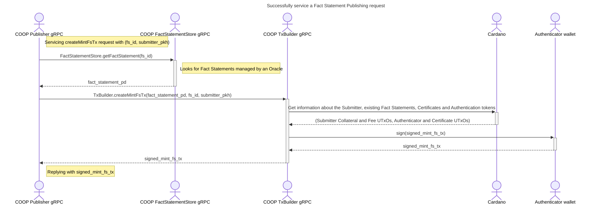
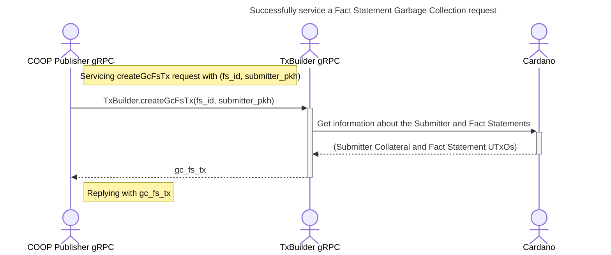

# COOP Backend protocol

This document contains information on the back-end operations needed to serve the [Frontend protocol](03-frontend-protocol.md).

## Publishing a Fact Statement

The successful result of this operation is a [Fact Statement Publishing transaction](02-plutus-protocol.md#mins-fact-statement-tx).

The [COOP Publisher gRPC](../coop-proto/publisher-service.proto) service starts off by looking up the requests Fact Statement IDs in the [COOP FactStatementStore gRPC](../coop-proto/fact-statement-store-service.proto) service.
This service provides the [PlutusData](https://github.com/input-output-hk/plutus/blob/master/plutus-core/plutus-core/src/PlutusCore/Data.hs#L40) encoding of the requested Fact Statements, and this representation format is what gets included in the [Fact Statement UTxOs]([Fact Statement UTxOs](02-plutus-protocol.md#fs-validator)) directly, which makes it possible for Consumer dApps to reference and intepret the information held within.
We provide a [JSON Fact Statement Store](../coop-extras/json-fact-statement-store) implementation of the [COOP FactStatementStore gRPC](../coop-proto/fact-statement-store-service.proto) service which can serve as a convenient low-scale backend that maintains JSON encoded Fact Statements.
This service uses a [Plutus Json](../coop-extras/plutus-json) canonical mapping library between the JSON and [PlutusData](https://github.com/input-output-hk/plutus/blob/master/plutus-core/plutus-core/src/PlutusCore/Data.hs#L40) data representation formats.

The [COOP TxBuilder gRPC](../coop-proto/tx-builder-service.proto) service is the only component that talks to the Cardano network.
It does so exclusively to discover information necessary to build a transaction:

- [Fact Statement UTxOs](02-plutus-protocol.md#fs-validator) for asserting which of the Fact Statements have already been published,
- [Collateral UTxOs](https://docs.cardano.org/plutus/collateral-mechanism) at the `Submitter` wallet,
- [Fee UTxOs](02-plutus-protocol.md#fee-token) at the `Submitter` wallet,
- [Authentication UTxOs](02-plutus-protocol.md#auth-token) at the [Authenticator wallet](02-plutus-protocol.md#authenticator),
- [Certificate UTxOs](02-plutus-protocol.md#cert-token) for asserting the validity of the provided [Authentication tokens](02-plutus-protocol.md#auth-token).

[Authenticator wallets](02-plutus-protocol.md#authenticator) provide their own signatures to the [Fact Statement Publishing transaction](02-plutus-protocol.md#mins-fact-statement-tx) to authenticate the spending of the [Authentication tokens](02-plutus-protocol.md#auth-token).

## Garbage collecting obsolete Fact Statements

The successful result of this operation is a [Fact Statement Garbage Collecting transaction](02-plutus-protocol.md#gc-fact-statement-tx).

The [COOP TxBuilder gRPC](../coop-proto/tx-builder-service.proto) service is the only component that talks to the Cardano network.
It does so exclusively to discover information necessary to build a transaction:

- [Fact Statement UTxOs](02-plutus-protocol.md#fs-validator) for asserting which of the Fact Statements are indeed obsolete and can be garbage collected,
- [Collateral UTxOs](https://docs.cardano.org/plutus/collateral-mechanism) at the `Submitter` wallet.
