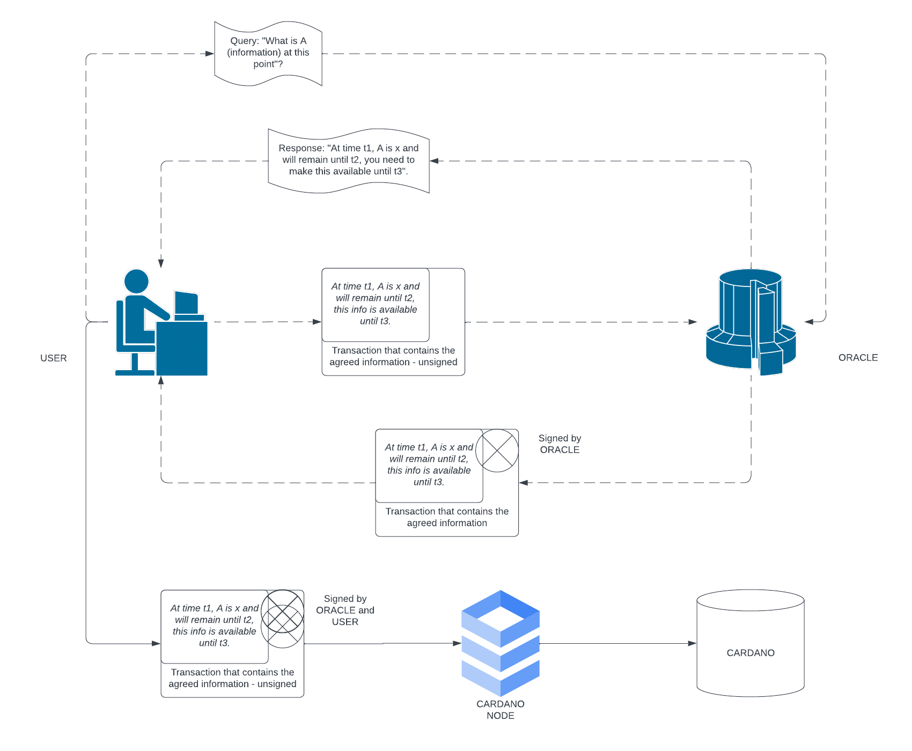

# Design Document

For the Cardano open oracle protocol, this document describes the design goals,
options considered, and the rationale for the design option selected for
implementation.

**Table of Contents**

- [Design Document](#design-document)
  - [Considered Designs](#considered-designs)
  - [Orcfax On-Chain Bulletin Board](#orcfax-on-chain-bulletin-board)
    - [Summary](#summary)
    - [Context](#context)
      - [Vasil Hardfork](#vasil-hardfork)
      - [Oracles prior to _Vasil Hardfork_](#oracles-prior-to-vasil-hardfork)
    - [Description](#description)
      - [Example](#example)
    - [Querying the Oracle](#querying-the-oracle)
    - [Signing the Transaction](#signing-the-transaction)
    - [Posting the Transaction](#posting-the-transaction)
    - [Protocol Assumptions](#protocol-assumptions)
  - [Resources](#resources)

## Considered Designs

As part of the design process, diverse ideas have been considered, with their
pros and cons discussed. These ideas are captured by the following Architectural Design Records (aka. ADRs):

  1. On-Chain Database discussed in [(docs-proposals-00-onchain-db)](./proposals/00-onchain-db.md)
  2. Off-Chain Database with On-Chain knowledge representation discussed in [(docs-proposals-01-offchain-db-mtree)](./proposals/01-offchain-db-mtree.md)
  3. [Off-Chain Database using signature scheme to validate correct information](./proposals/02-signature-scheme.md)

To summarise the above findings, the document
[docs-proposals-03-comparative-summary](./proposals/03-comparative-summary.md)
has been set-up, and captures a more condensed, comparison based critical view
of the above ideas. Following the above exploration an emergent design has been
reached, which will now be further expanded on in this document.

---

## Orcfax On-Chain Bulletin Board

### Summary

The Orcfax On-Chain Bulletin Board is an emerging, novel on-chain Oracle design.
The protocol, offers a sustainable way of posting trust-maintaining, verified
information on-chain, in a decentralised manner. Furthermore, the protocol
leverages the features introduced by the Vasil hardfork, allowing for seamless
protocol interoperability. Lastly the Orcfax proposal maintains a well defined
revenue stream for the Oracle providers. We also believe that the proposal is
scalable and can be adopted by many Oracle providers, enabling a well
distributed framework of decentralised information.

### Context

#### Vasil Hardfork

Cardano introduced in Vasil Hardfork (referred to as _VH_ from now on) many
features, from which we will focus on make reference a specific one: [CIP 31 -
Reference Inputs](https://cips.cardano.org/cips/cip31/). As a feature, CIP 31 - Reference Inputs allow a transaction to
include an EUTxO as part of the input set of another transaction without
spending the referenced EUTxO (for further details please refer to the CIP
itself).

#### Oracles prior to _Vasil Hardfork_

Prior to the _VH_, a trivial design for an Oracle would post its
information on chain as an EUTxO - most likely with the information posted as a
datum. The EUTxO would be locked to an address where the Oracle provider would
dictate the rules of consuming the EUTxO. These rules would include, fees,
potential rules for re-creating/propagating the information, etc. The oracle's
EUTxO (containing the information) would then be consumed as part of a
transaction to make proof of the supplied information, and the address' logic
would make sure that the additional conditions were met. 

This trivial Oracle design breaks with the addition of the Reference Inputs
feature of _VH_. Given that users can now reference inputs in their transaction
without consuming them, does not allow for the Oracle provider to impose rules
under which the Oracle's information can be consumed. Thus the Oracle provider
loses its financial mechanics and incentive to post information on-chain - to
the detriment of the entire eco-system.

The Orcfax protocol manages to maintain a sustainable funding strategy with the
addition of Reference Inputs, while maintaining a balanced incentive scheme for
both users and oracles providers.

### Description

The Orcfax proposal can be summarised as follows:

> Users post Oracle approved information on-chain for themselves and other users
received by the user, how information is verified by the Oracle, a standardised
format for the transaction and resulting EUTxO, how the information is consumed,
and how the Oracle gets compensated for the Service. Furthermore, Orcfax
provides an SDK for other Oracle providers to spin up instances of the protocol,
in a fast, secure, and proven way.

As made apparent by the above summary there are a few different aspects which
need to be clarified:

1. How does a User get the information - prior to it being available
   on-chain? Find the [answer here](#querying-the-oracle).

2. How does a User validate the information? Find the [answer here](#signing-the-transaction).

3. How do Users use the Posted information? Find the [answer here](#posting-the-transaction).

4. What are the assumptions at the basis of the protocol? Find the [answer here](#protocol-assumptions).

The document will follow up on each of these subjects and expand on its
technical and practical implications - creating the broad picture of the
protocol. The document will also make reference to a supporting _pure
implementation_ of the protocol (i.e. an implementation of a model of the
protocol that abstracts away all the _"real-world interaction"_, but allows the
testing of the protocol's technical assumptions).

Throughout the document we will make use of scenario based examples to clarify
the use-cases in discussion.

#### Example

> Imagine a public bulletin board in the Roman forum.
>
> Citizens know to come look at the board to find out the latest information
> that they care about.
>
> For example, if someone wants to refer to the current imperial price of gold,
> all they have to do is point their companion to the board.
>
> To prevent the board from being overcrowded with messages, each message posted
> must have a deposit of 2 denarii attached.
>
> Of course, the imperial administration itself can't be bothered to actually
> post the price on the board. Instead, if citizens want the current price to be
> visible on the board, they must go to the administration and get a signed
> message about the current price—paying the government for this service—and
> then post it themselves together with the required deposit.
>
> Later on, they can come back to rip down the message from the board and
> recover the deposit. To ensure that the contents of the board are relatively
> stable, messages must stay on the board for some minimum period of time. You
> wouldn't want to tell your companion to go to the forum and verify that you're
> telling the truth about the price, only for the message to be ripped down when
> they get there.
>
> Perhaps, when a benevolent imperator is in power, he may instruct his
> administration to waive the fee for signature and maybe even to subsidize the
> citizen's deposit for posting on the board. If he's feeling particularly
> generous, he can instruct the administration to just sign and post the
> messages themselves on the board.

---

### Querying the Oracle

> "How does the user get the information?"

In short, the user asks and receives the information offchain, with a time-based
guarantee from the Oracle for the correctness of the information provided.

To expand on the above, a user sends a query to the Oracle's exposed traditional
API (Rest API, graphQL, etc.) and receives:

1. **The information** that the Oracle would agree to sign. This represents the
   information itself.

2. **The meta-information** that needs to be included or shape the  transaction
that the Oracle will sign. This includes:

- fees that need to be paid, addresses for the payment,
- expiration date of the information (ED) - a time period for which the Oracle
  guarantees that the provided information would not change,
- the address at which the information will be posted,
- time to live for the information (TTL).

With this information, the user can now chose to formulate their own transaction
that will be  signed by the Oracle provider upon request. It is worth noting
that the signing only happens if the Oracle receives a transaction that is in
accordance with all of the previously requested information.

---

### Signing the Transaction

> How does a User validate the information?

Having formulated their transaction that conforms with the Oracle provided
information, the user sends the transaction to the Oracle to be signed. The
signature of the Oracle is important because it allows for an identifying NFT to
be minted for the EUTxO published by the user. This NFT represents the
correctness of the posted information. When signing, the Oracle verifies that
the transaction is handling its token correctly - but does not check the
validity of information which it is not concerned with. This property of
specific checking allows the User to bundle their information posting
transaction with other actions that depend on the information itself. If the
Oracle does not agree with the information, its API returns a HTTP response that
gives some indication why the validation failed.

---

### Posting the Transaction

With an Oracle signed transaction, all that the user must do is to sign their
own transaction and submit it to the Cardano blockchain for validation. 

### Protocol Assumptions

FIXME

---

## Resources

- CIP 31 - Reference Inputs (<https://cips.cardano.org/cips/cip31/#cddl>).

- Leonard Lys and Maria Potop-Butucaru, Distributed Blockchain Price Oracle,
  (<https://eprint.iacr.org/2022/603.pdf>).
