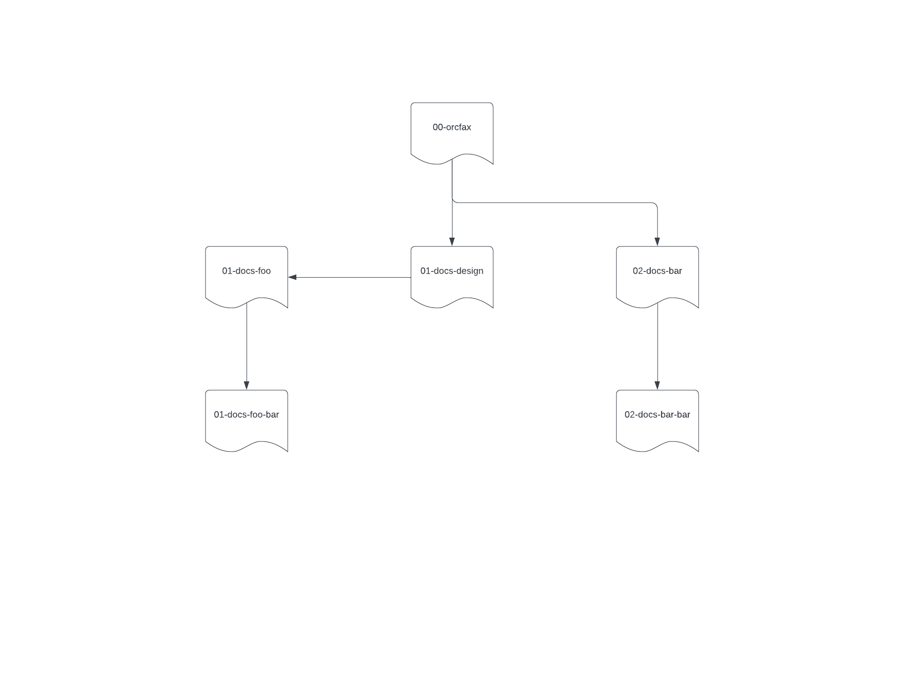

# Meta Documentation

## Table of Contents

<!-- markdown-toc start - Don't edit this section. Run M-x markdown-toc-refresh-toc -->
**Table of Contents**

- [Meta Documentation](#meta-documentation)
  - [Table of Contents](#table-of-contents)
  - [Summary](#summary)
  - [Requirement](#requirement)
  - [Description](#description)
    - [Document Structure](#document-structure)
    - [Terminology](#terminology)
      - [Preamble](#preamble)
      - [Headlines](#headlines)
      - [Markdown](#markdown)
  - [References](#references)

<!-- markdown-toc end -->

---

## Summary

The scope of the document is to set standards, and common practices for the
documentation produced for the _Orcfax_ project.

## Requirement

- [ ] Most of the practices are well defined.
- [ ] The document itself conforms with the requirements

## Description

The intent of the defined standards and common practices are to achieve clarity
and conciseness across documents and documentation. Furthermore, we hope that
the mental overhead in understanding the discussed information is reduced by
having a clear and concise template that contains useful meta information.

---

### Document Structure

1. Each document will be structured part of a tree structure reachable from the
main document (please refer to Figure 1, for a diagram example).

2. Each document will have an up to date Table of Contents.

3. Any significant change will be recorded as a Revision.

---

### Terminology

The terminology used throughout the documentation is inspired by the repository
`github:joelparkerhenderson/architecture-decision-record` specifically the
[planguage](https://github.com/joelparkerhenderson/architecture-decision-record/blob/main/templates/decision-record-template-using-planguage/index.md),
put forward by the author.

#### Preamble

The Preamble is the top part of a file where relevant information is included
about the file itself. The only information that should be present here is
linked to the following preamble keywords:

We define the following preamble keywords:

| Keyword          | Description                                                                                      |
| ---------------- | ------------------------------------------------------------------------------------------------ |
| tag              | A unique, persistent identifier.                                                                 |
| date             | The date of the revision.                                                                        |
| revision         | A version number for the statement. Two digits minimum.                                          |
| revision-summary | A short (20 words max.) description about what the revision changed.                             |
| author           | The persons that wrote the requirement. Also Responsible to change status from WIP to In Review. |
| reviewers        | The persons responsible to change the status from In Review to Done.                             |
| *implementer     | The persons responsible for implementing the requirement.                                        |
| *priority        | A statement of priority and claim on resources.                                                  |
| *stakeholders    | Parties affected by the information.                                                             |
| status           | The status of the document. Can be WIP, In Review, Done.                                         |

Note: Keywords marked with * are optional. Everything else is mandatory.

#### Headlines

Each Document must contain some specific information that allows a reader to
scan through the document and get the _Gist_ of the information. The mandatory
headers are:

| Headline     | Description                                                                                                  |
| ------------ | ------------------------------------------------------------------------------------------------------------ |
| Summary      | A brief summary of the requirement or area addressed.                                                        |
| Description  | An in depth discussion on the points discussed by the document.                                              |
| Requirement  | The text that details the requirement itself. For a task to be done it must satisfy all of its requirements. |
| Rationale    | The reasoning that justifies the requirement.                                                                |
| *Assumptions | An assumption thought to be true. May have impact if proven otherwise.                                       |
| *Risks       | Anything that could cause malfunction, delay, or other negative impacts.                                     |
| *Definitions | The definition of a term (better to use a glossary)                                                          |
| Links        | Sources for the information in the text, or further information.                                             |

Note: Headlines marked with * are optional. Everything else is mandatory.

#### Markdown

All documents should satisfy as many rules as possible from the
[markdown-lint](https://github.com/DavidAnson/markdownlint/blob/v0.25.1/doc/Rules.md#md025)
document.

---

## References

1. [https://github.com/joelparkerhenderson/architecture-decision-record/blob/main/templates/decision-record-template-using-planguage/index.md](https://github.com/joelparkerhenderson/architecture-decision-record/blob/main/templates/decision-record-template-using-planguage/index.md)
2. [Markdown Lint](https://github.com/DavidAnson/markdownlint/blob/v0.25.1/doc/Rules.md)