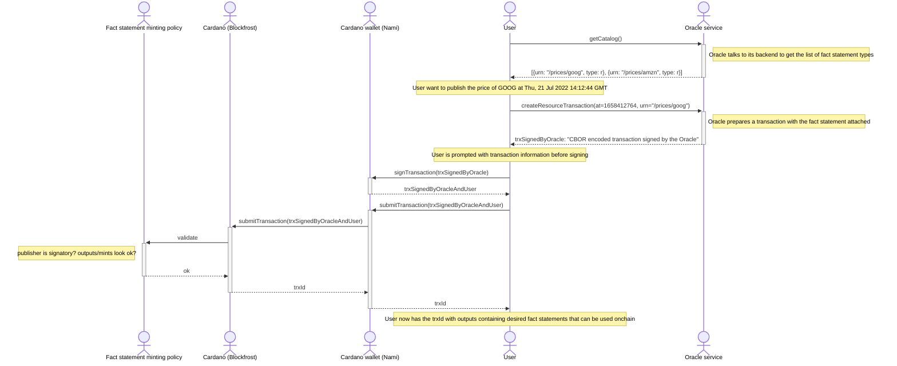

# Publishing a fact statement

```mermaid
sequenceDiagram
  actor resourceMp as Fact statement minting policy
  actor cardano as Cardano (Blockfrost)
  actor wallet as Cardano wallet (Nami)
  actor user as User
  actor oracle as Oracle service

  user ->>+ oracle: getCatalog()
  note right of oracle: Oracle talks to its backend to get the list of fact statement types
  oracle -->>- user: [{urn: "/prices/goog", type: r}, {urn: "/prices/amzn", type: r}]
    
  note over user: User want to publish the price of GOOG at Thu, 21 Jul 2022 14:12:44 GMT
  user ->>+ oracle: createResourceTransaction(at=1658412764, urn="/prices/goog")
  note right of oracle: Oracle prepares a transaction with the fact statement attached
  oracle -->>- user: trxSignedByOracle: "CBOR encoded transaction signed by the Oracle"
  
  note over user: User is prompted with transaction information before signing
  user ->>+ wallet: signTransaction(trxSignedByOracle)
  wallet -->>- user: trxSignedByOracleAndUser

  user ->>+ wallet: submitTransaction(trxSignedByOracleAndUser)
  wallet ->>+ cardano: submitTransaction(trxSignedByOracleAndUser)
  cardano ->>+ resourceMp: validate
  note left of resourceMp: publisher is signatory? outputs/mints look ok?
  resourceMp -->>- cardano: ok
  cardano -->>- wallet: trxId
  wallet -->>- user: trxId
  note over user: User now has the trxId with outputs containing desired fact statements that can be used onchain
```
