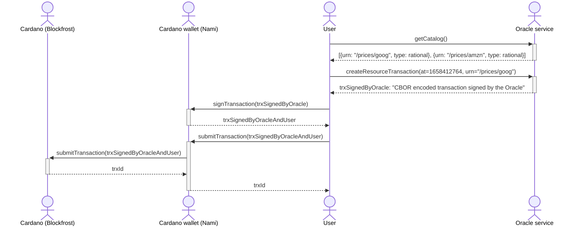

# Publishing a fact statement

```mermaid
sequenceDiagram
  actor Cardano (Blockfrost)
  actor Cardano wallet (Nami)
  actor User
  actor Oracle service
    
  User ->>+ Oracle service: getCatalog()
  Oracle service -->>- User: [{urn: "/prices/goog", type: rational}, {urn: "/prices/amzn", type: rational}]
    
  User ->>+ Oracle service: createResourceTransaction(at=1658412764, urn="/prices/goog")
  Oracle service -->>- User: trxSignedByOracle: "CBOR encoded transaction signed by the Oracle"
  
  User ->>+ Cardano wallet (Nami): signTransaction(trxSignedByOracle)
  Cardano wallet (Nami) -->>- User: trxSignedByOracleAndUser

  User ->>+ Cardano wallet (Nami): submitTransaction(trxSignedByOracleAndUser)
  Cardano wallet (Nami) ->>+ Cardano (Blockfrost): submitTransaction(trxSignedByOracleAndUser)
  Cardano (Blockfrost) -->>- Cardano wallet (Nami): trxId
  Cardano wallet (Nami) -->>- User: trxId

```
