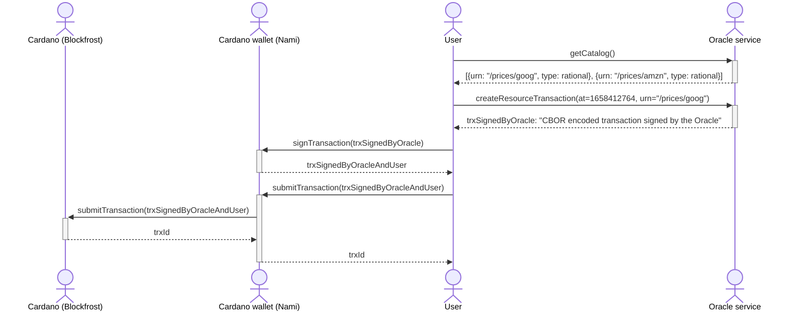

# Publishing a fact statement

```mermaid
sequenceDiagram
  actor cardano as Cardano (Blockfrost)
  actor wallet as Cardano wallet (Nami)
  actor user as User
  actor oracle as Oracle service
    
  user ->>+ oracle: getCatalog()
  oracle -->>- user: [{urn: "/prices/goog", type: rational}, {urn: "/prices/amzn", type: rational}]
    
  user ->>+ oracle: createResourceTransaction(at=1658412764, urn="/prices/goog")
  oracle -->>- user: trxSignedByOracle: "CBOR encoded transaction signed by the Oracle"
  
  user ->>+ wallet: signTransaction(trxSignedByOracle)
  wallet -->>- user: trxSignedByOracleAndUser

  user ->>+ wallet: submitTransaction(trxSignedByOracleAndUser)
  wallet ->>+ cardano: submitTransaction(trxSignedByOracleAndUser)
  cardano -->>- wallet: trxId
  wallet -->>- user: trxId
```
