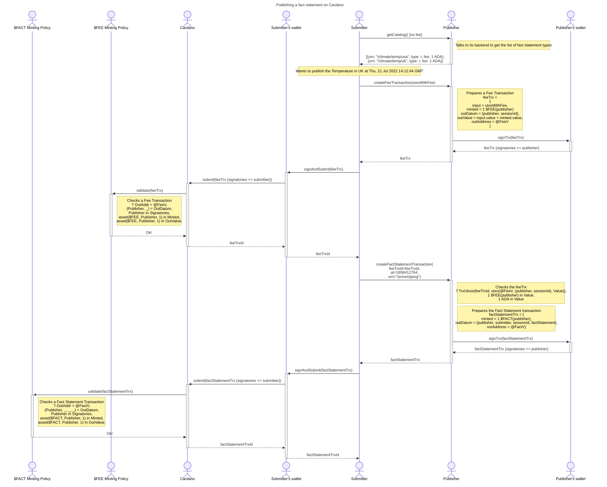

# Publishing a fact statement

Definitions:

- **Publisher** is a service that interacts with Submitter clients and Resolver services. It packages fee and fact statements in Cardano transactions,
- **Publisher's Work** is the work done by the Publisher that includes a Resolver in a process called 'query resolution',
  - Requesting information from a remote commerical data APIs,
  - Requesting information from a decentralized oracle pool (validation, consensus).
- **Submitter** is a Publisher client that eventually submits a fact statement transaction on Cardano,
- **Consumer** is a Cardano DApp (Plutus program + frontend) that uses a published Fact Statement.

Properities:

- Publisher's Work has to be paid for in terms of Fees,
- The Publisher can't be overwhelmed by 'free' operations,
- The Fee can be collected by the Publisher only after the Submitter successfully submitted the Fact Statement transaction,
- Consumer Plutus programs can verify that a certain Fact Statement is signed by the Publisher

## Interaction

