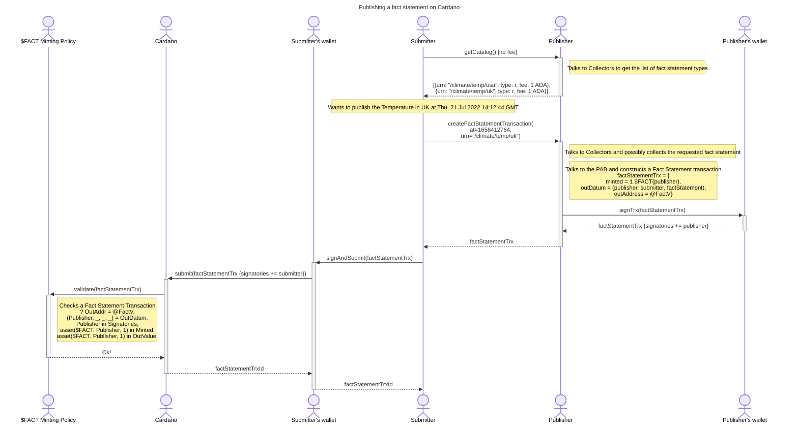

# Publishing a fact statement

**Submitters** ask the **Publisher** for a certain **Fact Statement** for a particular point in time, and the **Publisher** delivers a partially signed Cardano transaction for the **Submitter** to sign and submit to the Cardano ledger. This transaction contains an output containing the Fact Statement datum that any Cardano DApp can reference and use.

## Definitions

- **Publisher** is a service that interacts with Submitter clients and Collector and PAB services. It collects and packages fact statements in Cardano transactions along with the fees,
- **Publisher's Work** is the work done by the Publisher that ends in successful service delivery to the Submitter,
  - Requesting information from a remote commerical data APIs,
  - Requesting information from a decentralized oracle pool (validation, consensus).
- **Submitter** is a Publisher client that eventually submits a fact statement transaction on Cardano,
- **Consumer** is a Cardano DApp (Plutus programs + environment) that uses a published Fact Statement,
- **Collector** is a service that interacts with a data collection backend and delivers fact statements to Publisher clients.

## Properities

- 1.1 Publisher's Work MUST be paid for in terms of the Publishing Fee,
  - **STATUS**: DONE ([caveat](#fee-escrow))
- 2.1 Consumer CAN verify that a certain Fact Statement is signed by the Publisher,
  - **STATUS**: DONE
- 3.1 Submitter SHOULD NOT pay for failed Publishing,
  - **STATUS**: DONE
- 3.3 Submitter CAN reclaim Cardano operational costs (minUtxoAda, ttl),
  - **STATUS**: TODO (requires the **Fact Statement Validator** (aka @FactV)

### Interaction

## Appendix

### Fee Escrow

**STATUS**: We're not implemeting the fee escrow due to added complexity, time lag and cost that it would introduce in the system.

[From Wikipedia](https://en.wikipedia.org/wiki/Escrow)

> An escrow is a contractual arrangement in which a third party (the stakeholder or escrow agent) receives and disburses money or property for the primary transacting parties, with the disbursement dependent on conditions agreed to by the transacting parties

Fee escrow protocol SHOULD lock the **Publishing Fee** in a @FeeV Plutus validator via a Fee transaction cosigned by both Publisher and Submitter. The Publisher can claim the Fee by proving a successful Publishing and Submitter can claim the Fee back by proving a failed Publishing.

#### Properities

1. Publisher MUST be able assert the existence of the valid Fee escrow by inspecting the submitted Fee transaction, before proceeding to doing any additional work.
2. Publisher MUST be able to claim the Fee by providing a proof of a successful Publishing.
3. Submitter MUST be able to claim the Fee by providing a proof of a failed Publishing.
4. Submitter MUST be able to reclaim the Cardano operational fees (ie. minUtxoAda).

Pros:

- Prop 1.1 is strongly satisfied

Cons:

- More transactions,
- Added complexity, time lag and cost.
